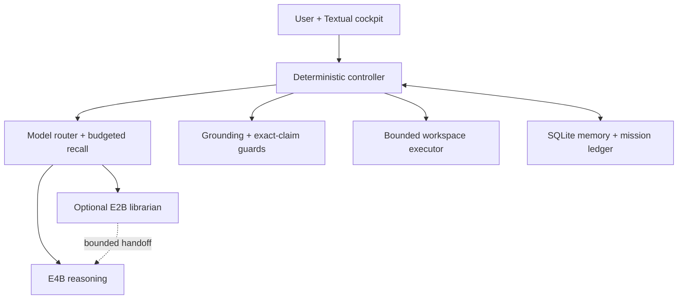

<p align="center">
  
</p>

<p align="center">
  <strong>A local-first intelligence cockpit with private long-term memory, fail-closed web grounding, and a bounded autonomous workspace.</strong>
</p>

<p align="center">
  <a href="LICENSE"></a>
  <a href="CHANGELOG.md"></a>
  <a href=".github/workflows/tests.yml"></a>
  
</p>

Project Intermix runs the language model, inference controller, SQLite memory, Textual interface, grounding router, and fixed workspace locally. It is designed to make an 8K physical context feel much larger by retrieving durable facts, recent decisions, task state, and verified project history on demand instead of replaying an ever-growing transcript.

This repository is a developer preview, not a polished Android application. The reference build is end-to-end verified on one Pixel 10 Pro; every other device remains a candidate until a reproducible community report says otherwise.

## Why it exists

- **Local sovereignty:** conversations, memory, model execution, and workspace files remain on the device by default.
- **Virtual continuity:** SQLite FTS5 recall, typed events, summaries, and a separate mission ledger survive restarts and fresh sessions.
- **Truth before fluency:** volatile questions can trigger web research; weak evidence produces an error or limitation instead of a confident invention.
- **Adaptive grounding:** difficult lookups use one controller-planned primary query and, only when needed, one bounded parallel follow-up round for corroboration, implementation detail, and limitations.
- **Bounded autonomy:** the Core may read, write, and test inside one fixed workspace. Deletions require explicit review and hash revalidation.
- **Resource awareness:** a resident LiteRT-LM engine is reused while memory permits, then unloaded under pressure or sustained inactivity.
- **Optional dual-model routing:** a smaller E2B librarian can handle ordinary conversation and prepare bounded context for E4B reasoning while only one model stays resident.
- **Recoverable generation:** the phone UI stays interactive during inference, exposes STOP, caps native output, and quarantines mechanically corrupted or interrupted replies before memory or voice.
- **Readable terminal UX:** cyan/violet hierarchy, an auto-growing multiline composer, streamed plain text, final Markdown rendering, foldable diagnostics, compact mode, and a workspace lens.

## Verified reference profile

| Component | Reference result |
|---|---|
| Device | Google Pixel 10 Pro, Tensor G5, 16 GB RAM |
| OS / shell | Android 17, Termux |
| Runtime | Python 3.13.13, LiteRT-LM 0.16.1, GPU/OpenCL |
| Model | Gemma 4 E4B-it `.litertlm`; optional E2B librarian supplied separately |
| Physical context | 8,000 tokens |
| Cold/idle available memory | Approximately 7.0–7.6 GiB in the owner's test environment |
| Resident-hot available memory | Approximately 2.6–3.7 GiB in the owner's test environment |
| Cooling used during long tests | Optional Black Shark Magnetic/FunCooler 6 Pro (BR62); approximately 25 °C owner-observed device temperature |
| Test suite | 87 deterministic public-alpha checks across memory, routing, grounding, cancellation, stream integrity, inference, workspace, release safety, and interface behavior |

These are observations, not guarantees. Android memory pressure, other applications, firmware, drivers, ambient temperature, model build, and compiled caches can materially change the result.

## Compatibility tiers

| Tier | Meaning | Current entries |
|---|---|---|
| **Reference verified** | Full install, memory, inference, grounding, workspace, restart, and UI path tested | Pixel 10 Pro / Tensor G5 / Android 17 / Termux |
| **Runtime candidate** | Upstream LiteRT-LM demonstrates the model/backend class, but Intermix is not yet validated | Galaxy S26 Ultra and other current Android flagships |
| **Community experimental** | Capability probe passes; a contributor is collecting evidence | Other Android/DeX/desktop-mode devices, Linux ARM/x86_64 |
| **Unsupported** | Below resource floor, incompatible architecture, or missing LiteRT-LM runtime | Determined by the installer and device report |

Google's current Gemma 4 documentation includes E2B and E4B benchmarks on the Galaxy S26 Ultra, which makes it a compelling test target—not a verified Intermix device. LiteRT-LM itself supports Python on Android, Linux, macOS, and Windows, but each Intermix backend and interface path still needs its own report.

See [the device matrix](docs/DEVICE_MATRIX.md) before making or repeating a compatibility claim, [the installation guide](docs/INSTALLATION.md) before testing a new device, and the [Sovereign Glass design contract](docs/ANDROID_DESIGN.md) for the native Android interface direction.

## Install

### 1. Prepare Termux

Install a current Termux build from its official F-Droid or GitHub channels. Do not mix Termux and plugin APKs signed by different sources. Then grant shared-storage access:

```bash
termux-setup-storage
```

### 2. Supply a model separately

Project Intermix does **not** redistribute model weights. Obtain a compatible `.litertlm` model under its own license and place it in a Termux-readable location. The interactive installer finds nearby models and lets you choose one.

E4B remains the required reasoning model. An E2B file is optional: when present,
the deterministic controller routes ordinary conversation through it and uses a
bounded E2B intent/memory handoff before difficult E4B turns. The engine closes
one profile before loading the other; this is not a simultaneous two-model RAM load.

Google documents current LiteRT-LM models and conversion paths in the [Gemma 4 deployment guide](https://developers.google.com/edge/litert-lm/models/gemma-4).

### 3. Run the local installer

From a cloned repository or extracted signed release:

```bash
cd Project_Intermix_Public_v1.4.1-alpha.1
bash install.sh
```

The installer:

1. checks architecture, Android, RAM, available memory, storage, and terminal width;
2. installs missing Termux/Python dependencies;
3. asks for the user name, Core name, model, workspace, and safe context size;
4. runs the complete isolated test suite;
5. creates a private rollback snapshot;
6. stages a versioned release and mode-600 local config;
7. initializes SQLite without importing legacy data; and
8. activates the launchers without loading the model.

For scripted testing:

```bash
bash install.sh \
  --non-interactive \
  --model "$HOME/models/gemma-4-E4B-it.litertlm" \
  --librarian-model "$HOME/models/gemma-4-E2B-it.litertlm" \
  --dual-model auto \
  --user-name "Operator" \
  --assistant-name "Intermix Core" \
  --context-tokens 8000
```

Inspect the plan without changing Project Intermix files:

```bash
bash install.sh --dry-run --model /path/to/model.litertlm
```

### 4. Launch

```bash
intermix
```

The historical `sovereign` command remains as a compatibility alias.

The first model load can take several minutes while GPU artifacts are compiled. Later turns reuse the resident engine while memory permits. Intermix never treats Android `MemFree` as usable headroom; the cockpit reports `MemAvailable`.

## First checks

Inside the cockpit:

```text
/status
/engine status
/generation status
/model status
/persona status
/web status
/memory audit
/files
```

The chat composer preserves pasted paragraphs and intentional blank lines. Press
`Enter` to send, or `Shift+Enter` / `Ctrl+Enter` to insert a newline. It grows
from the existing compact three-row rail to seven visible rows, then scrolls
internally and collapses after submission.

Outside the cockpit, create a report safe to attach to a GitHub issue:

```bash
intermix-doctor --json > intermix-device-report.json
```

The default report does not load the model, run inference, read personal files, or collect serial numbers, Android IDs, usernames, hostnames, IP addresses, credentials, prompts, or absolute paths.

## Provider setup

No web credential is required for local chat. Optional providers are configured outside the cockpit through hidden input:

```bash
intermix-providers
```

Keys are stored only in `~/.config/intermix/providers.env` with mode `600`, are allowlisted controller-side, and are never shown in provider status, placed in SQLite, or passed to the model. Do not paste keys into chat, issues, screenshots, or logs.

Grounding uses query classification and a bounded provider wave. The controller derives at most three anchored query wordings from the user's request. It tries the primary wording first and launches one parallel follow-up round only when the evidence is missing or lacks independent corroboration. Official resolvers and authoritative registries are preferred for exact claims; optional search APIs expand coverage; DuckDuckGo is a cooled fallback. Captcha, proxy rotation, IP hopping, and rate-limit evasion are deliberately out of scope.

Inspect the deterministic plan before searching with `/web plan …`, and inspect the most recent execution budget with `/web last plan`. Non-exact grounded answers may offer a short evidence-backed “Further path” about implementation, design rationale, trade-offs, or limitations; that section is omitted when sources do not support it.

See [provider policy](docs/PROVIDERS.md).

## Memory and wellbeing data

Fresh public installs default sensitive wellbeing capture to **off**. A user may explicitly opt in:

```text
/memory sensitive on
```

Even then, Intermix records only explicit first-person self-reports, marks them sensitive, applies bounded retention, and retrieves them only for a matching query. It rejects inferred diagnoses. Use `/memory audit`, `/memory event forget`, and `/memory event purge` to inspect or remove entries.

Intermix is not a medical device, therapist, crisis service, or substitute for professional care. See [memory architecture](docs/MEMORY.md) and the [privacy model](docs/PRIVACY.md).

Explicit communication preferences can update the reversible persona profile.
`/persona history` shows its changelog and `/persona undo` reverts the newest
active revision. Intermix does not infer diagnoses or immutable personality traits.

`/sanctuary status` is deliberately fail-closed in Termux. It does not claim an
encrypted vault or collect extra raw conversations. Encrypted Sanctuary remains
reserved for a future APK implementation backed by Android Keystore and biometric authentication.

## Optional Resonance voice bridge

The Kokoro/Resonance path is intentionally separate from the core release. On the verified Pixel setup, Android's Debian Linux environment renders completed responses to WAV and Termux performs Android-native playback. The model is loaded lazily, only after explicit voice consent, and the managed archive retains at most 25 unpinned WAV files.

No Kokoro model, voice pack, Debian image, or audio is bundled here. Follow [the optional voice guide](docs/VOICE.md) only after the text stack is stable.

## Architecture



The language model proposes prose, memories, and workspace actions. Deterministic controller code decides what can be displayed, stored, researched, or executed. See [architecture](docs/ARCHITECTURE.md) and the [native Android design contract](docs/ANDROID_DESIGN.md).

## Key commands

| Command | Purpose |
|---|---|
| `/web …` | Force a grounded answer or visible failure |
| `/web plan …` | Inspect grounding intent without inference |
| `/web last plan` | Inspect executed queries, request budget, sources, and follow-up activation |
| `/workspace …` | Start/resume a durable bounded mission |
| `/create …` | Allocate the long-form creation budget |
| `/files` | Open the collaborative workspace lens |
| `/memory facts` | Inspect durable facts |
| `/memory audit` | Review typed and sensitive-memory policy |
| `/cancel` or `Ctrl+X` | Stop the foreground generation or active workspace operation |
| `/generation status` | Inspect the latest foreground-generation lifecycle state |
| `/sessions` | Reopen conversation sessions |
| `/engine status` | Inspect cold/hot state and latency telemetry |
| `/engine unload` | Release the resident model explicitly |
| `/model status` | Inspect routing, availability, and the active profile |
| `/model mode auto\|librarian\|reasoning` | Override automatic routing locally |
| `/persona status\|history\|undo` | Inspect or reverse communication-style evolution |
| `/sanctuary status` | Confirm the current encryption capability truthfully |
| `/status` | Show local system diagnostics |

## Safety boundaries

- The fixed workspace is the only automatic read/write/test surface.
- Generated deletions never execute immediately.
- Tool output and web content are untrusted data, not instructions.
- Uncited forced-web drafts are discarded before display.
- Weak or conflicting exact evidence produces a guarded failure.
- Sensitive memory is opt-in on fresh public installs and never inferred.
- Idle work runs only while the cockpit is open and idle.
- Provider keys, model weights, memory databases, caches, audio, and user workspaces are excluded from source control.

## Community development

Useful contributions include:

- reproducible device reports and latency/memory measurements;
- official-source provider adapters and relevance tests;
- Samsung DeX, other Android desktop modes, Linux ARM, and desktop profiles;
- compact-layout and accessibility improvements;
- memory retrieval evaluations with synthetic data;
- resource-pressure, Signal 9, and long-session regressions; and
- deterministic safety tests.

Read [CONTRIBUTING.md](CONTRIBUTING.md) before opening an issue or pull request. Never upload a live `memory/`, `models/`, `.shaders/`, provider vault, workspace, audio archive, or raw transcript.

## Project status

`1.4.1-alpha.1` is the first sanitized public-source candidate derived from the private Trust + Speed v1.4.1 reference build. The next milestone is evidence, not spectacle: clean installs, device profiles, reproducible benchmarks, provider reliability, compact-mode polish, and a stable release manifest. The longer path toward a Kotlin/Compose APK and capability-gated NPU acceleration is documented in the [roadmap](docs/ROADMAP.md) and [native Android feasibility brief](docs/NATIVE_ANDROID.md).

## License

Project Intermix source code is licensed under [Apache License 2.0](LICENSE). Models, voice packs, provider services, Android, Termux, LiteRT-LM, Gemma, Kokoro, and other dependencies retain their own licenses and terms.
