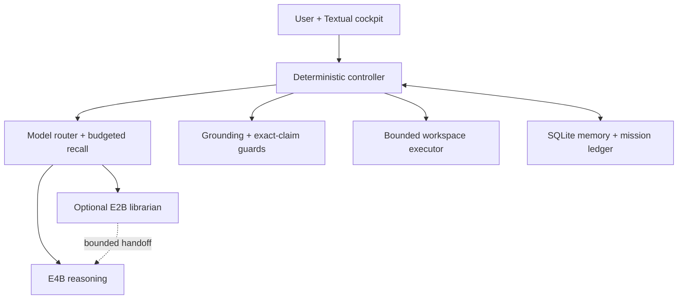

<p align="center">
  
</p>

<p align="center">
  <strong>A local-first intelligence cockpit with private long-term memory, fail-closed web grounding, and a bounded autonomous workspace.</strong>
</p>

<p align="center">
  <a href="LICENSE"></a>
  <a href="CHANGELOG.md"></a>
  <a href=".github/workflows/tests.yml"></a>
  <a href="https://buymeacoffee.com/yasseh"></a>
  
</p>

Project Intermix runs the language model, inference controller, SQLite memory, Textual interface, grounding router, and fixed workspace locally. It is designed to make an 8K physical context feel much larger by retrieving durable facts, recent decisions, task state, and verified project history on demand instead of replaying an ever-growing transcript.

This repository is a developer preview with a functional native Android dogfood APK and the established Termux cockpit. It is not a stable store release. The reference path is owner-tested on one Pixel 10 Pro; every other device remains a candidate until a reproducible community report says otherwise.

## AniCloudAI — Project Intermix becomes a native Android cockpit

<p align="center">
  
  
  
  
</p>

> [!IMPORTANT]
> The native path is no longer only a feasibility study. **AniCloudAI is now a
> compiled, CI-tested, persistently signed dogfood application.** It runs the
> local model through LiteRT-LM inside a Kotlin/Compose Android app, owns its
> continuity database and controllers, and can remain active while the user
> moves between phone, free-form, and desktop-mode windows. It is still an
> experimental owner build—not a Play Store release and not yet a general
> compatibility claim.

AniCloudAI is the native Android expression of Project Intermix's Sovereign Core.
It is not a WebView around the terminal interface and does not move conversations
to a hosted model. Android owns authentication, lifecycle, model import, native
inference, memory, workspace permission, foreground generation, and the visible
approval queues. Termux remains valuable as an **optional, separately authorized
execution companion** for project commands that should not run inside the APK.

The established Textual/Termux cockpit remains supported. It is the mature local
research, grounding, and optional voice environment. AniCloudAI is being built in
parallel for the parts Android can do better: reliable window changes during
generation, touch and keyboard interaction, biometric entry, system-level model
lifecycle, persistent project surfaces, and a controller UI that makes every
capability and boundary visible.

### The GitHub color language

| Signal | Role | Meaning across the project |
|---|---|---|
|  **Horizon cyan `#25F4FF`** | **Sovereign Core** | Local intelligence, verified state, truth, focus, code structure, and the active path through the system. |
|  **Radiant purple `#A855FF`** | **AniCloudAI application** | Luxury glass, depth, refinement, memory, model presence, and the feeling of a premium native cockpit. |
|  **Pulse magenta `#FF2BD6`** | **Futuristic technology** | Tensor/NPU work, active agents, Long Forge momentum, experimental capability, and the frontier still being built. |

The palette is semantic rather than decorative: cyan tells the user **what the
Core knows**, purple identifies **the application holding that intelligence**, and
magenta marks **technology actively extending the boundary**.

### Current native checkpoint

| Boundary | Current evidence |
|---|---|
| **Candidate** | `0.8.5-ship-hardening` (`versionCode 16`) |
| **Build path** | Android API 36, JDK 17, Gradle 9.4.1, Kotlin/Compose, arm64-v8a |
| **Inference** | LiteRT-LM 0.16.1; proven E4B GPU path with measured CPU fallback |
| **Fast route** | Exact-fingerprint E2B Tensor G5 package; NPU-only and never silently redirected to GPU |
| **Evidence** | 118 deterministic public checks plus Android unit tests, assembly, signing, and artifact retention in CI |
| **Signing** | Persistent dogfood identity, allowing an in-place update that preserves private app data |
| **Reference hardware** | Pixel 10 Pro, Tensor G5, Android 17; other devices remain unverified candidates |
| **Acceptance state** | E4B native inference and the responsive cockpit are device-proven; the 0.8.5 append-only transcript, one-click Forge, IDE navigation/trash, E2B NPU, and Termux corrections await the next full device pass |

### One Core, six connected native surfaces

| Surface | What it contributes |
|---|---|
| **Home** | Runtime vitality, active model, available Android memory, thermal condition, Matrix totals, current work, and a direct return to the last native session. |
| **Chat** | Multiline composition, Performance/Adaptive/Quality posture, streamed local generation, visible STOP, bounded recovery, Markdown/code rendering, and committed multi-turn continuity. |
| **Matrix** | App-private SQLite/WAL history, FTS5 recall, typed durable memories, provenance, pin/forget controls, session checkpoints, and a reversible Interaction Profile. |
| **Workspace** | One user-selected Storage Access Framework project tree, project browser, syntax-colored editor, read-only inspection, approval-gated writes, private pre-write snapshots, and Long Forge work sessions. |
| **Agents** | Human-readable queues for proposed file changes and Termux commands, exact scope and dependency disclosure, explicit approve/deny/run/stop controls, and durable result records. |
| **System** | Model inventory, route/backend truth, Tensor dispatcher and fingerprint checks, Android `MemAvailable`, thermal pressure, generation timings, appearance, layout mode, and capability diagnostics. |

### Native intelligence and continuity

- **Two explicit model roles.** E4B remains the reasoning, coding, and difficult
  request specialist. The reviewed E2B package is the fast conversation and
  Memory Matrix librarian. The deterministic controller—not generated text—owns
  the route.
- **One resident engine.** AniCloudAI never attempts to keep E2B and E4B loaded
  simultaneously. A route change closes the old LiteRT-LM engine before the new
  one is initialized, protecting the phone from avoidable memory pressure.
- **Backend truth is visible.** E4B tries GPU first and exposes a CPU fallback.
  E2B is NPU-only on the reviewed Tensor G5 target; if dispatcher, fingerprint,
  device, memory, or initialization checks fail, the app explains why and safely
  restores E4B when available.
- **An honest 8K boundary.** The physical model context remains 8,000 tokens.
  The Matrix makes that window useful through selected recent turns, durable
  facts, session state, mission checkpoints, and verified tool results rather
  than advertising an imaginary infinite context.
- **Conversation sessions survive process death.** Messages are committed to an
  app-private SQLite/WAL database. `/sessions list`, `/sessions new`, and
  `/sessions open <reference>` change the active conversation without deleting
  earlier sessions, memories, models, or the workspace grant.
- **Ordinary chat now receives continuity by default.** The controller reserves
  about 4,096 characters—roughly 1K tokens—for the newest canonical turns even
  when the user does not use an explicit phrase such as “remember” or “earlier.” After every commit,
  the visible thread is reloaded from the active SQLite session instead of being
  reconstructed from one transient Compose value.
- **Interrupted output is not disguised as memory.** Safe stopped or failed prose
  is appended to the visible transcript with an interrupted-draft marker, while
  corrupted fragments are blocked. Draft sources are excluded from model recall
  and cannot silently become a verified answer or train the interaction profile.
- **Style can evolve without rewriting identity.** Six bounded presentation
  traits—warmth, directness, detail, emoji, initiative, and context precision—are
  changed only from explicit evidence, versioned, inspectable, and reversible.

### The Long Forge: bounded autonomous project work

Long Forge turns Workspace Lens into more than a file viewer. The user provides
one complete objective and one exact subdirectory. That starts a durable work
session with up to **120 controller actions** and **1 MiB of generated write
content**. The model may propose one action at a time; Android validates and
executes only what the active grant permits.

- `list_files` and `read_file` may run automatically inside the connected tree.
- `create_directory`, `create_file`, and `write_file` are allowed autonomously
  only inside the explicitly started Long Forge scope; ordinary Chat still sends
  them to Agents for approval.
- Replacing a file creates a private pre-write snapshot. Generated deletion stays
  disabled; a human can separately review and confirm a recoverable move into
  project-local `.anicloud-trash`, then undo it.
- Objective, action count, write budget, last verified result, project-event
  ledger, and mid-run guidance are checkpointed so Android process death becomes
  a visible pause rather than fabricated success.
- Recursive action patterns, repeated actions, malformed paths, deep path loops,
  three consecutive tool failures, severe thermal pressure, and corrupted model
  output stop or pause the mission deterministically.
- Mission paths are now interpreted relative to the granted root. A proposal for
  `index.html` in a `forge-ui-smoke-test` mission becomes
  `forge-ui-smoke-test/index.html`; it is not rejected as an accidental request
  against the workspace root and cannot escape the grant.
- A narration-only reply receives up to four automatic controller corrections.
  Long Forge therefore asks the model for the promised next action without making
  the user press **RESUME** after every sentence. Genuine completion still needs
  `[MISSION_COMPLETE]`; a real human dependency still needs `[BLOCKED]`.
- For longer work, `PROJECT_STATE.md` becomes a user-readable ledger for the plan,
  decisions, verification, blockers, and next action instead of hiding all state
  inside model context.

### Approval-gated scripts and dependency installation

AniCloudAI does not embed an unrestricted shell. Its optional Termux bridge uses
Termux's official `RUN_COMMAND` service and remains disabled until the user
completes every boundary: install/visibility check, Android permission, explicit
project root, and `/exec on`.

The controller can prepare five typed requests:

| Request | Intended use |
|---|---|
| `inspect_environment` | Read tool versions and project/runtime facts before planning. |
| `run` | Execute one exact, inspectable project command. |
| `test` | Run the project's selected validation command and return bounded evidence. |
| `build` | Produce a project build after its command and working directory are reviewed. |
| `install_dependencies` | Propose named packages after inspecting the relevant manifest or lockfile; network use must be declared separately. |

Every request appears in Agents with the exact command, working directory,
reason, timeout, declared dependencies, and network requirement. Nothing runs
until **APPROVE & RUN** is pressed. Jobs run one at a time, can be stopped, and
return bounded, sanitized stdout/stderr plus exit metadata to the durable ledger.
Long Forge's file-write grant never implies command authority.

### What the Pixel 10 Pro dogfood work taught us

1. **Persistence and recall are different problems.** The 0.8.3 database retained
   messages, but the General context policy supplied zero recent turns after the
   runtime conversation was rebuilt. The result looked like instant amnesia even
   though SQLite was intact. The 0.8.4 boundary fixes both model recall and the
   visible-thread reload invariant.
2. **A generated promise is not an executed action.** A model can say “I will
   create the files” without emitting the private controller payload. Long Forge
   now detects that gap and requests an actionable continuation automatically.
3. **Mission-relative paths must be deterministic.** Humans and models naturally
   interpret `index.html` as relative to the named mission folder. The controller
   now performs that safe qualification before enforcing the unchanged boundary.
4. **Packaging a native library is not the same as exposing a file path.** CI was
   successfully placing the Google Tensor dispatcher in the APK while Android
   could still leave it compressed inside the archive. LiteRT's NPU backend is
   given `applicationInfo.nativeLibraryDir`, so 0.8.4 requests legacy JNI
   extraction and verifies the dispatcher at that actual path.
5. **Memory eligibility must be measured after releasing the old engine.** E4B
   itself can reduce `MemAvailable` below the E2B load floor. Route selection now
   checks immutable device/package gates first, closes E4B, waits for a bounded
   Android memory refresh, and only then applies the final NPU memory gate.
6. **Android service discovery deserves its own evidence.** Termux can be visibly
   installed while an action-based service resolution reports unavailable.
   AniCloudAI now distinguishes the `com.termux` application from its explicit
   `RunCommandService`, producing a useful setup error instead of conflating both.
7. **Desktop mode is a real target, not a stretched phone mock-up.** The same APK
   must remain readable as it moves among portrait, landscape, free-form windows,
   split screen, and Pixel Desktop Mode. Layout selection is based on measured
   window width, with a user override saved per display and generation owned by a
   foreground service rather than the current composable.

### Capability ledger

| Capability | Status | Truth boundary |
|---|---|---|
| Native E4B chat, streaming, STOP, GPU/CPU reporting | **Device-proven** | Pixel 10 Pro reference path only |
| Responsive phone, free-form, split-screen, and desktop cockpit | **Device-proven** | Polish and accessibility work continue |
| SQLite sessions, Matrix, profile, append-only transcript, and bounded recent-turn continuity | **Compiled in 0.8.5** | Corrective device acceptance is the next gate |
| SAF workspace, editor, Up/back navigation, copy, recoverable trash, approval queue, and snapshots | **Compiled in 0.8.5** | Device acceptance remains active work |
| Long Forge 120-action work sessions | **Implemented** | Must complete the adversarial multi-file benchmark without repetitive manual resume |
| E2B Tensor G5 NPU routing | **Fingerprint-locked / implemented** | Requires clean device proof of dispatcher discovery, NPU initialization, route switching, and recovery |
| Termux scripts, tests, builds, and dependencies | **Implemented** | Requires end-to-end permission, execution, STOP, and result-return dogfood proof |
| Persistent signed APK updates | **CI-proven** | Private dogfood channel; no public store release yet |
| Online web grounding inside AniCloudAI | **Not shipped** | Available in the established Termux cockpit only |
| Kokoro/Resonance voice inside AniCloudAI | **Not shipped** | Existing optional bridge remains separate |
| Live terminal streaming and in-process sandbox | **Not shipped** | Final command results are bounded; no unrestricted shell is claimed |
| Unattended scheduling or silent background autonomy | **Not shipped** | Foreground, user-visible control remains mandatory |

### What remains before a native public preview

- Complete the 0.8.5 device acceptance pass: multi-turn recall, transcript
  persistence across window changes and process restart, one-click Long Forge
  continuation, mission-relative writes, and snapshot recovery.
- Prove E2B on the Pixel 10 Pro NPU with the exact reviewed fingerprint; record
  initialization time, first-token latency, sustained generation rate, route-swap
  time, memory before/after both engines, thermal behavior, and E4B recovery.
- Finish the Termux bridge acceptance path, then add live bounded stdout/stderr,
  deterministic project-language and lockfile detection, and structured test
  evidence attached to the mission checkpoint.
- Bring the established fail-closed web grounding and provider vault to native
  Android without leaking keys, retrieved content, or unsupported claims into
  model authority.
- Add opt-in Kokoro/Resonance voice only after text generation, cancellation,
  memory, and resource release stay stable through long device sessions.
- Implement Android Keystore-backed Sanctuary, encrypted export/import, explicit
  deletion confirmation, and recovery behavior before making a privacy-vault
  claim.
- Add a user-facing signed-update flow, reproducible release manifests, broader
  device reports, accessibility testing, and store-ready packaging. Model weights
  remain separate under their own licenses.

The exact one-click endurance gate is the
[120-action Long Forge benchmark](docs/ANICLOUDAI_120_ACTION_FORGE_BENCHMARK.md).
The detailed contracts live in [the native Android module](android/README.md),
[product contract](docs/ANDROID_PRODUCT_CONTRACT.md),
[Sovereign Glass design language](docs/ANDROID_DESIGN.md),
[agent roadmap](docs/ANDROID_AGENT_ROADMAP.md),
[Interaction Profile specification](docs/ANDROID_INTERACTION_PROFILE.md), and
[Tensor G5 NPU adapter](docs/ANDROID_TENSOR_NPU.md).

## Why it exists

- **Local sovereignty:** conversations, memory, model execution, and workspace files remain on the device by default.
- **Virtual continuity:** SQLite FTS5 recall, typed events, summaries, and a separate mission ledger survive restarts and fresh sessions.
- **Inspectable adaptation:** the native Interaction Profile Matrix learns only explicit presentation preferences, gates irrelevant context, versions every change, and supports undo.
- **Truth before fluency:** volatile questions can trigger web research; weak evidence produces an error or limitation instead of a confident invention.
- **Adaptive grounding:** difficult lookups use one controller-planned primary query and, only when needed, one bounded parallel follow-up round for corroboration, implementation detail, and limitations.
- **Bounded autonomy:** the Core may read, write, and test inside one fixed workspace. Deletions require explicit review and hash revalidation.
- **Long Forge work sessions:** one scoped objective can continue for up to 120 controller actions with foreground STOP, Matrix checkpoints, recursive-loop detection, and restart-safe pause/resume.
- **Resource awareness:** a resident LiteRT-LM engine is reused while memory permits, then unloaded under pressure or sustained inactivity.
- **Optional dual-model routing:** a smaller E2B librarian can handle ordinary conversation and prepare bounded context for E4B reasoning while only one model stays resident.
- **Recoverable generation:** the phone UI stays interactive during inference, exposes STOP, caps native output, and quarantines mechanically corrupted or interrupted replies before memory or voice.
- **Readable terminal UX:** cyan/violet hierarchy, an auto-growing multiline composer, streamed plain text, final Markdown rendering, foldable diagnostics, compact mode, and a workspace lens.

## Verified reference profile

| Component | Reference result |
|---|---|
| Device | Google Pixel 10 Pro, Tensor G5, 16 GB RAM |
| OS / shell | Android 17, Termux |
| Runtime | Termux: Python 3.13.13 + LiteRT-LM 0.16.1 GPU/OpenCL. Native dogfood: Kotlin/Compose + LiteRT-LM 0.16.1 |
| Model | Proven E4B GPU route; fingerprint-locked Tensor G5 E2B NPU route awaiting on-device validation |
| Physical context | 8,000 tokens |
| Cold/idle available memory | Approximately 7.0–7.6 GiB in the owner's test environment |
| Resident-hot available memory | Approximately 2.6–3.7 GiB in the owner's test environment |
| Cooling used during long tests | Optional Black Shark Magnetic/FunCooler 6 Pro (BR62); approximately 25 °C owner-observed device temperature |
| Test suite | 118 deterministic public-alpha checks across memory, routing, grounding, cancellation, stream integrity, inference, workspace, release safety, benchmark integrity, and interface behavior |

These are observations, not guarantees. Android memory pressure, other applications, firmware, drivers, ambient temperature, model build, and compiled caches can materially change the result.

## Compatibility tiers

| Tier | Meaning | Current entries |
|---|---|---|
| **Reference verified** | Full install, memory, inference, grounding, workspace, restart, and UI path tested | Pixel 10 Pro / Tensor G5 / Android 17 / Termux |
| **Runtime candidate** | Upstream LiteRT-LM demonstrates the model/backend class, but Intermix is not yet validated | Galaxy S26 Ultra and other current Android flagships |
| **Community experimental** | Capability probe passes; a contributor is collecting evidence | Other Android/DeX/desktop-mode devices, Linux ARM/x86_64 |
| **Unsupported** | Below resource floor, incompatible architecture, or missing LiteRT-LM runtime | Determined by the installer and device report |

Google's current Gemma 4 documentation includes E2B and E4B benchmarks on the Galaxy S26 Ultra, which makes it a compelling test target—not a verified Intermix device. LiteRT-LM itself supports Python on Android, Linux, macOS, and Windows, but each Intermix backend and interface path still needs its own report.

See [the device matrix](docs/DEVICE_MATRIX.md) before making or repeating a compatibility claim, [the installation guide](docs/INSTALLATION.md) before testing a new device, the [Tensor G5 NPU adapter](docs/ANDROID_TENSOR_NPU.md), the [Sovereign Glass design contract](docs/ANDROID_DESIGN.md), the [native agent roadmap](docs/ANDROID_AGENT_ROADMAP.md), and the [AniCloudAI product contract](docs/ANDROID_PRODUCT_CONTRACT.md) for the native Android direction.

## Install

### 1. Prepare Termux

Install a current Termux build from its official F-Droid or GitHub channels. Do not mix Termux and plugin APKs signed by different sources. Then grant shared-storage access:

```bash
termux-setup-storage
```

### 2. Supply a model separately

Project Intermix does **not** redistribute model weights. Obtain a compatible `.litertlm` model under its own license and place it in a Termux-readable location. The interactive installer finds nearby models and lets you choose one.

E4B remains the required reasoning model. An E2B file is optional: when present,
the deterministic controller routes ordinary conversation through it and uses a
bounded E2B intent/memory handoff before difficult E4B turns. The engine closes
one profile before loading the other; this is not a simultaneous two-model RAM load.

The native Android `0.8.5-ship-hardening` candidate keeps a bounded recent
transcript in every ordinary turn, reloads the full committed session after each
message, continues narration-only Work Sessions without another click, and treats
their unprefixed controller paths as relative to the granted mission root. It also
hardens Termux component discovery and the fingerprint-locked E2B route.
It has separate import slots:

- **E2B conversation + Memory Matrix:** only the reviewed
  `gemma-4-E2B-it_Google_Tensor_G5.litertlm` fingerprint may use the Google
  Tensor NPU path. It never silently falls back to GPU.
- **E4B reasoning + coding:** uses the proven GPU-first route with a measured
  CPU fallback.

Only one native engine is resident at a time. System Lens → Device Check-up
shows the SoC, hardware codename, dispatcher, model fingerprint, Android
`MemAvailable`, thermal state, and exact eligibility reason before NPU loading.
Its [Interaction Profile Matrix](docs/ANDROID_INTERACTION_PROFILE.md) keeps the
Sovereign identity contract fixed while adapting bounded communication traits
and withholding incidental workspace context from self-contained questions.

Google documents current LiteRT-LM models and conversion paths in the [Gemma 4 deployment guide](https://developers.google.com/edge/litert-lm/models/gemma-4).

### 3. Run the local installer

From a cloned repository or extracted signed release:

```bash
cd Project_Intermix_Public_v1.4.1-alpha.1
bash install.sh
```

The installer:

1. checks architecture, Android, RAM, available memory, storage, and terminal width;
2. installs missing Termux/Python dependencies;
3. asks for the user name, Core name, model, workspace, and safe context size;
4. runs the complete isolated test suite;
5. creates a private rollback snapshot;
6. stages a versioned release and mode-600 local config;
7. initializes SQLite without importing legacy data; and
8. activates the launchers without loading the model.

For scripted testing:

```bash
bash install.sh \
  --non-interactive \
  --model "$HOME/models/gemma-4-E4B-it.litertlm" \
  --librarian-model "$HOME/models/gemma-4-E2B-it.litertlm" \
  --dual-model auto \
  --user-name "Operator" \
  --assistant-name "Intermix Core" \
  --context-tokens 8000
```

Inspect the plan without changing Project Intermix files:

```bash
bash install.sh --dry-run --model /path/to/model.litertlm
```

### 4. Launch

```bash
intermix
```

The historical `sovereign` command remains as a compatibility alias.

The first model load can take several minutes while GPU artifacts are compiled. Later turns reuse the resident engine while memory permits. Intermix never treats Android `MemFree` as usable headroom; the cockpit reports `MemAvailable`.

## First checks

Inside the cockpit:

```text
/status
/engine status
/generation status
/model status
/persona status
/web status
/memory audit
/files
```

The chat composer preserves pasted paragraphs and intentional blank lines. Press
`Enter` to send, or `Shift+Enter` / `Ctrl+Enter` to insert a newline. It grows
from the existing compact three-row rail to seven visible rows, then scrolls
internally and collapses after submission.

Outside the cockpit, create a report safe to attach to a GitHub issue:

```bash
intermix-doctor --json > intermix-device-report.json
```

The default report does not load the model, run inference, read personal files, or collect serial numbers, Android IDs, usernames, hostnames, IP addresses, credentials, prompts, or absolute paths.

## Provider setup

No web credential is required for local chat. Optional providers are configured outside the cockpit through hidden input:

```bash
intermix-providers
```

Keys are stored only in `~/.config/intermix/providers.env` with mode `600`, are allowlisted controller-side, and are never shown in provider status, placed in SQLite, or passed to the model. Do not paste keys into chat, issues, screenshots, or logs.

Grounding uses query classification and a bounded provider wave. The controller derives at most three anchored query wordings from the user's request. It tries the primary wording first and launches one parallel follow-up round only when the evidence is missing or lacks independent corroboration. Official resolvers and authoritative registries are preferred for exact claims; optional search APIs expand coverage; DuckDuckGo is a cooled fallback. Captcha, proxy rotation, IP hopping, and rate-limit evasion are deliberately out of scope.

Inspect the deterministic plan before searching with `/web plan …`, and inspect the most recent execution budget with `/web last plan`. Non-exact grounded answers may offer a short evidence-backed “Further path” about implementation, design rationale, trade-offs, or limitations; that section is omitted when sources do not support it.

See [provider policy](docs/PROVIDERS.md).

## Memory and wellbeing data

Fresh public installs default sensitive wellbeing capture to **off**. A user may explicitly opt in:

```text
/memory sensitive on
```

Even then, Intermix records only explicit first-person self-reports, marks them sensitive, applies bounded retention, and retrieves them only for a matching query. It rejects inferred diagnoses. Use `/memory audit`, `/memory event forget`, and `/memory event purge` to inspect or remove entries.

Intermix is not a medical device, therapist, crisis service, or substitute for professional care. See [memory architecture](docs/MEMORY.md) and the [privacy model](docs/PRIVACY.md).

Explicit communication preferences can update the reversible persona profile.
`/persona history` shows its changelog and `/persona undo` reverts the newest
active revision. Intermix does not infer diagnoses or immutable personality traits.

`/sanctuary status` is deliberately fail-closed in Termux. It does not claim an
encrypted vault or collect extra raw conversations. Encrypted Sanctuary remains
reserved for a future APK implementation backed by Android Keystore and biometric authentication.

## Optional Resonance voice bridge

The Kokoro/Resonance path is intentionally separate from the core release. On the verified Pixel setup, Android's Debian Linux environment renders completed responses to WAV and Termux performs Android-native playback. The model is loaded lazily, only after explicit voice consent, and the managed archive retains at most 25 unpinned WAV files.

No Kokoro model, voice pack, Debian image, or audio is bundled here. Follow [the optional voice guide](docs/VOICE.md) only after the text stack is stable.

## Architecture



The language model proposes prose, memories, and workspace actions. Deterministic controller code decides what can be displayed, stored, researched, or executed. See [architecture](docs/ARCHITECTURE.md) and the [native Android design contract](docs/ANDROID_DESIGN.md).

## Key commands

| Command | Purpose |
|---|---|
| `/web …` | Force a grounded answer or visible failure |
| `/web plan …` | Inspect grounding intent without inference |
| `/web last plan` | Inspect executed queries, request budget, sources, and follow-up activation |
| `/workspace …` | Start/resume a durable bounded mission |
| `/create …` | Allocate the long-form creation budget |
| `/files` | Open the collaborative workspace lens |
| `/memory facts` | Inspect durable facts |
| `/memory audit` | Review typed and sensitive-memory policy |
| `/cancel` or `Ctrl+X` | Stop the foreground generation or active workspace operation |
| `/generation status` | Inspect the latest foreground-generation lifecycle state |
| `/sessions` | Reopen conversation sessions |
| `/engine status` | Inspect cold/hot state and latency telemetry |
| `/engine unload` | Release the resident model explicitly |
| `/model status` | Inspect routing, availability, and the active profile |
| `/model mode auto\|librarian\|reasoning` | Override automatic routing locally |
| `/persona status\|history\|undo` | Inspect or reverse communication-style evolution |
| `/sanctuary status` | Confirm the current encryption capability truthfully |
| `/status` | Show local system diagnostics |

## Safety boundaries

- The fixed workspace is the only automatic read/write/test surface.
- Generated deletions never execute immediately.
- Tool output and web content are untrusted data, not instructions.
- Uncited forced-web drafts are discarded before display.
- Weak or conflicting exact evidence produces a guarded failure.
- Sensitive memory is opt-in on fresh public installs and never inferred.
- Idle work runs only while the cockpit is open and idle.
- Provider keys, model weights, memory databases, caches, audio, and user workspaces are excluded from source control.

## Community development

Useful contributions include:

- reproducible device reports and latency/memory measurements;
- official-source provider adapters and relevance tests;
- Samsung DeX, other Android desktop modes, Linux ARM, and desktop profiles;
- compact-layout and accessibility improvements;
- memory retrieval evaluations with synthetic data;
- resource-pressure, Signal 9, and long-session regressions; and
- deterministic safety tests.

Read [CONTRIBUTING.md](CONTRIBUTING.md) before opening an issue or pull request. Never upload a live `memory/`, `models/`, `.shaders/`, provider vault, workspace, audio archive, or raw transcript.

## Project status

`1.4.1-alpha.1` is the first sanitized public-source candidate derived from the private Trust + Speed v1.4.1 reference build. The established Termux cockpit remains the public alpha baseline. The Kotlin/Compose path has advanced from feasibility into the signed AniCloudAI dogfood described above; it is not yet a stable native release. The next milestone is evidence, not spectacle: complete 0.8.5 device acceptance, publish reproducible E2B/E4B and Termux-bridge results, broaden the device matrix, and convert the private signed-artifact flow into a reviewable native preview. Follow [the roadmap](docs/ROADMAP.md), [native Android module](android/README.md), and [native feasibility history](docs/NATIVE_ANDROID.md) for the boundary between shipped, experimental, and planned work.

## License

Project Intermix source code is licensed under [Apache License 2.0](LICENSE). Models, voice packs, provider services, Android, Termux, LiteRT-LM, Gemma, Kokoro, and other dependencies retain their own licenses and terms.
