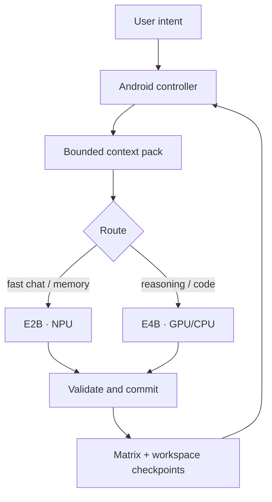

# AniCloudAI Context, Memory, and Environment Architecture

> **Research and implementation decision record · 12 September 2026**  
> **Status:** engineering candidate, not a public-release claim  
> **Scope:** Project Intermix native Android cockpit, E2B/E4B routing, Memory Matrix, Workspace, Long Forge, and Story Forge

## Executive decision

AniCloudAI should not ship publicly merely because the APK installs, a local model answers once, or a button can start a mission. A weak first release would spend the most valuable resource the project has: the patience and trust of early testers and potential co-development architects.

The product should enter a small, explicitly labelled **design-partner alpha** only after four binary gates pass on the reference device:

1. **Continuity:** a long conversation reopens at the latest message, prior messages remain visible and copyable, and relevant recent context survives without overflowing the model.
2. **Long-form execution:** a 120-segment Story Forge run advances from deterministic checkpoints, writes exactly one durable artifact, survives interruption, never leaks private protocol, and stops at the exact boundary.
3. **Environment truth:** every file, calculation, script, dependency, route, and permission claim corresponds to controller-observed state; no model narration is presented as an executed result.
4. **Recovery:** capacity, cancellation, process death, invalid protocol, failed tools, and model-route failures either recover once from durable state or stop with an inspectable checkpoint.

The core architectural conclusion is equally direct:

> An “infinite-feeling context window” is not an infinite prompt. It is a controller illusion created by durable state, selective reconstruction, bounded inference calls, and transparent recovery.

Long-context research shows that merely placing more text inside a nominal window does not ensure reliable use of that text: models can underuse information in the middle, and effective context can be substantially shorter than advertised.[^1][^2] Systems such as MemGPT therefore treat context as managed memory rather than an ever-growing transcript.[^3] AniCloudAI should follow that systems approach while keeping Android—not model prose—as the authority.

## What “learning” must mean in this product

The base model does **not** update its neural weights after each chat. Claiming otherwise would be misleading. AniCloudAI can still become materially more useful over time through five inspectable mechanisms:

| Layer | What changes | Authority | Reversible? | Product wording |
|---|---|---|---|---|
| Working context | The evidence selected for the next call | Deterministic controller | Yes, every call | “Uses the relevant working set” |
| Episodic memory | What happened in prior turns and missions | Append-only Matrix records | Yes | “Remembers prior events” |
| Semantic memory | Explicit facts, preferences, goals, and decisions | Validated Memory Matrix writes | Yes | “Learns what you explicitly teach it” |
| Procedural memory | Verified reusable plans, commands, and skills | Controller-reviewed skill ledger | Yes | “Reuses proven procedures” |
| Interaction profile | Communication settings backed by explicit evidence | Bounded profile revisions | Yes | “Adapts how it communicates” |
| Parametric adaptation | Optional LoRA or other weight deltas | Separate opt-in training workflow | Must be versioned and removable | Never imply this happens during ordinary chat |

This distinction follows cognitive-agent architectures that separate working, episodic, semantic, and procedural memory,[^4] retrieval-augmented systems that keep knowledge outside model weights,[^5] and test-time memory work that evaluates retrieval, learning, long-range understanding, and selective forgetting as different capabilities.[^11]

## Reference architecture

The local database and user-granted project tree remain the canonical source of truth. This matches Android’s offline-first guidance: higher layers read local state, network integrations update that local state through repositories, and the UI does not depend directly on a network response.[^28] Storage Access Framework tree grants remain user-selected and persistable rather than turning into broad filesystem authority.[^29]

### Seven state classes

1. **Immutable runtime contract:** identity, safety boundaries, protocol grammar, and truthful capability language.
2. **Current request:** the user’s newest message or controller continuation instruction; highest prompt priority.
3. **Immediate conversation:** approximately the newest one thousand useful tokens, with turn boundaries and speaker identity.
4. **Durable mission checkpoint:** objective, authorized root, action budget, verified last result, user guidance, progress, and append cursor.
5. **Memory Matrix recall:** selected explicit facts, preferences, decisions, and related events with provenance and recency.
6. **Environment snapshot:** current project tree summary, selected file, route, device/runtime facts, permissions, and tool results.
7. **Long-form continuity:** latest committed prose plus a compact continuity capsule; generated drafts do not become state until validation and durable append succeed.

These classes must never be flattened into one uncontrolled transcript. CoALA’s central lesson is that memory modules and structured actions should be explicit parts of an agent’s decision process,[^4] while ReAct demonstrates the value of interleaving decisions with actual environment observations rather than free-form action claims.[^15]

## Termux-to-native continuity parity audit

The established Python/Termux engine is the minimum intelligence baseline for the native app. The comparison is not “terminal UI versus Compose UI”; it is whether a fresh model call receives the same quality of reconstructed state. Reading the actual repository implementation shows that Termux already composes identity, a session checkpoint, a larger recent tail, lexical long-term recall, archived conversation, a typed second-brain timeline, reversible persona preferences, verified task state, environment evidence, response policy, numeric anchors, and optional grounded evidence. The Android shell had matching database nouns, but several session fields were never populated and ordinary chat withheld the session checkpoint. That is a functional gap even when neither runtime has reached its physical context limit.

| Termux baseline | Repository evidence | Native status in this candidate | Remaining parity work |
|---|---|---|---|
| Hard 8K prompt budgeting with output reserve and compaction report | `engine/prompt_builder.py` | **Candidate parity:** `ContextOrchestrator.kt` uses conservative budgets, headroom, a 20-policy ledger, and one capacity recovery | Calibrate estimates against real E2B/E4B tokenizers and reference-device failures |
| Recent conversation reconstructed newest-first | `prompt_builder._format_recent` reserves up to 1,800 estimated tokens | **Deliberate bounded parity:** Android hard-reserves about 4,096 characters, approximately the requested 1K recent tokens | Measure 30-turn pronoun, correction, and topic-return cases; increase only from evidence |
| Active session summary, current task, open loops, and decisions | `prompt_builder._session_block`; `memory_protocol.apply_memory_payload` | **Gap closed in source:** Android now populates an extractive user-sourced capsule plus current task, open loops, and decisions, and includes it in ordinary chat | Add source-message IDs and a reviewed abstractive episode layer; never replace exact evidence with a free summary |
| Deterministic explicit event capture before inference | `second_brain.capture_explicit_events` | **Gap closed in source:** `ContinuityCapturePolicy` captures bounded verbatim project, preference, goal, and decision signals without model invention | Add inspectable domain filters, retention controls, and separately consented sensitive timelines |
| Semantic durable memory plus archive retrieval | `memory_retriever.retrieve_context`; `MemoryStore.search_memories/search_messages` | **Near parity:** exact-quote Memory Matrix, FTS5, salience fallback, archived messages, and exact-duplicate consolidation | Add source-type weighting, time decay, contradiction handling, diversity, and explicit abstention |
| Typed second-brain domain retrieval | `second_brain.query_domains/retrieve_second_brain_context` | **Partial:** native explicit captures enter semantic Matrix recall, but do not yet have a separate typed event table | Add event domains and query gating only after the user can inspect, export, forget, and control retention |
| Reversible communication adaptation | `persona_manager.py` | **Native parity/improvement:** six bounded traits, exact evidence, revisions, manual controls, and undo | Reference-device conversation tests for unwanted drift and cross-topic contamination |
| Verified task ledger that survives model resets | `task_ledger.py` | **Partial parity:** native missions persist objective, root, guidance, action trail, budgets, state, last result, and Story cursor | Port stronger mutation-after-test completion rules, failure signatures, file hashes, and cross-session verified-work answers |
| Verified project events available to later questions | `MemoryStore.record_project_event`; `format_recent_verified_work` | **Gap closed in source:** native project-scoped recall now injects recent controller-owned project events | Add cross-session/project namespaces and a user-facing provenance explanation |
| Incremental project structure document | `workspace_documenter.py` | **Missing:** Android exposes the connected root and typed reads, but not a durable code-symbol/tree manifest | Build an incremental SAF manifest with path, type, size, hash, language, symbols, and change cursor |
| Freshness classifier, evidence cache, and idle fact refresh | `freshness_policy.py`; `temporal_refresh.py` | **Missing:** native UI truthfully reports grounding offline | Provider vault, explicit per-request network boundary, citations, TTL, revocation, and fail-closed validation |
| Deterministic E2B/E4B role routing and optional librarian handoff | `model_router.py`; `llm_controller._generate_librarian_handoff` | **Partial and unproven:** native routing exists, but E2B/NPU and a useful two-model handoff have not passed the reference device | Prove E2B two-turn continuity, model release/reload, fallback, latency, and handoff quality |
| Response-specific allocation, including larger creation output | `response_policy.py` | **Different policy:** native exposes 1,024/1,536/2,048 tokens per call and uses checkpointed multi-call lanes for longer artifacts | Add a measured long-answer allocation only if LiteRT/device tests show it does not starve prefill or destabilize GPU/NPU |
| Numeric anchors plus post-generation repair | `numeric_integrity.py` | **Partial parity:** Numeric Matrix calculates typed arithmetic and Android checks missing exact anchors | Add full arithmetic-claim validation and one private repair epoch before display |
| Generation watchdog and quarantined partials | `generation_guard.py` | **Near parity:** native detects corruption, keeps safe interrupted drafts visibly non-canonical, and rebuilds conversation state | Stress STOP, process death, repeated blocks, malformed protocol, and capacity recovery on-device |

This audit changes the release claim: an APK is not “Termux parity” because it can retrieve a few messages. Native parity requires successful reconstruction across these independent layers, with device evidence. Until the red rows close, the Android app remains a dogfood/design-partner candidate and the Termux engine remains the reference continuity implementation.

## The 20-policy context pack in this candidate

The Android candidate packages exactly twenty controller policies in `ContextOrchestrator.kt`. “Packaged” means implemented and covered by source/unit assertions; it does **not** mean reference-device acceptance has passed.

| # | Policy | Concrete behavior | Failure it addresses |
|---:|---|---|---|
| 1 | Output reserve | Reserves 1,024, 1,536, or 2,048 output tokens per call | Generation colliding with prefill state |
| 2 | System reserve | Budgets an explicit allowance for immutable runtime instructions | Invisible prompt overhead |
| 3 | Safety headroom | Keeps a fixed unused margin below the physical state ceiling | Tokenizer and runtime estimation error |
| 4 | Conservative estimate | Uses a deliberately pessimistic character-to-token estimate | Model-specific tokenization uncertainty |
| 5 | Hard prompt fit | Refuses to send more than the computed prompt budget | Native `Prefill input length` failure |
| 6 | Current-request priority | Preserves the newest request during compaction | Answering an old concern instead of the user’s latest intent |
| 7 | Recent-turn reservation | Keeps a bounded recent transcript before weaker retrieval | One-turn amnesia and topical drift |
| 8 | Semantic Matrix recall | Adds only relevant, validated durable memories | Repeating the full history on every call |
| 9 | Durable mission objective | Reinjects the stable goal on every workspace continuation | Losing the task after a fresh conversation |
| 10 | Continuity capsule | Carries the last committed structured state | Long-form contradictions |
| 11 | Guidance tail | Gives newest user interruption precedence | Continuing an obsolete plan |
| 12 | Story prose tail | Includes the latest committed prose, never an uncommitted draft | Voice and scene discontinuity |
| 13 | Lane-specific prompt | Uses distinct Chat, Workspace, and Story prompt builders | Protocol collision and wrong-mode behavior |
| 14 | Protocol minification | Sends the smallest sufficient grammar for the active lane | Contract text consuming the working set |
| 15 | Workspace context elision | Withholds project material unless the relevance gate opens | Irrelevant file anchoring and privacy leakage |
| 16 | Fresh controller conversation | Recreates native conversation state between controller cycles | Hidden-state accumulation across 120 steps |
| 17 | Private payload shield | Story payload never streams into the visible transcript | Raw tags and rejected prose reaching the user |
| 18 | Durable chunk checkpoint | Persists each accepted mission unit before continuing | Process death losing completed work |
| 19 | Idempotent append recovery | Detects an already committed long-form segment | Duplicate chapters after a crash |
| 20 | Context ledger telemetry | Stores measurements, lane, compaction, and headroom—not prompt text | Invisible regressions and accidental secondary content copies |

The pack preserves both the controller-contract head and newest-state tail when compaction is unavoidable. On a capacity-shaped native failure, it recreates the conversation and retries exactly once with a smaller recovery pack. Other failures do not enter an indiscriminate retry loop.

## Why 2K is not the long-form ceiling

LiteRT-LM’s `maxOutputToken` controls one generation call. Its Android API separately creates conversations, accepts initial messages, supports streamed callbacks/flows, and exposes manual tool calling.[^26] Therefore:

- **Quality · 2,048 tokens/call** is a per-call output reserve.
- It is not a 2,048-token conversation limit.
- It is not a 2,048-token file or novel limit.
- A long document is a sequence of validated, checkpointed calls.
- Increasing output length without reserving prefill capacity can make overflow more likely.

For Story Forge, Android owns the loop: reconstruct bounded state → generate one private scene → parse → validate → append → checkpoint → start a fresh call. This resembles Re3’s plan/state/revision pipeline for long stories,[^20] but moves persistence and ordinal control outside the model.

## Broad implementation catalogue

The following catalogue intentionally exceeds the requested fifty approaches. It separates mechanisms that can be composed from mutually exclusive claims and research ideas. Status codes:

- **P0** — present in the context-orchestrator candidate; still requires device acceptance.
- **P1** — next implementation or hardening target before/opening design-partner alpha.
- **P2** — valuable after the hard release wall.
- **R** — research-only or dependent on a different model/runtime.
- **X** — reject as a product strategy.

### A. Physical context budgeting and reconstruction

| # | Mechanism | Status | AniCloudAI use |
|---:|---|:---:|---|
| 1 | Explicit physical-token ceiling | P0 | One shared 8K runtime/controller constant |
| 2 | Per-mode output reservation | P0 | Performance, Adaptive, and Quality reserve different decode space |
| 3 | Immutable-system reserve | P0 | Accounts for instructions not visible in the turn builder |
| 4 | Tokenizer uncertainty margin | P0 | Pessimistic estimate prevents optimistic overflow |
| 5 | Fixed safety headroom | P0 | Leaves recovery space beneath the native ceiling |
| 6 | Hard preflight fit | P0 | No oversized string reaches inference intentionally |
| 7 | Fresh native conversation per controller cycle | P0 | Hidden state cannot grow across a 120-step run |
| 8 | Single smaller recovery pack | P0 | Capacity failure gets one bounded retry |
| 9 | Current-message hard reservation | P0 | New user intent survives compaction |
| 10 | Head-and-tail preservation | P0 | Keeps governing contract and newest checkpoint |
| 11 | Lane-specific budgets | P1 | Tune Chat, Workspace, and Story from measured token distributions |
| 12 | Real tokenizer count before send | P1 | Replace conservative character estimate when LiteRT exposes a stable tokenizer API |
| 13 | Dynamic headroom from observed error rate | P2 | Increase/decrease margins only from versioned telemetry |
| 14 | Prompt-section manifest | P1 | Record included section IDs, byte counts, and reasons without recording content |
| 15 | Context-diff reconstruction | P2 | Reuse unchanged cached encodings if the runtime safely supports it |

Long-input benchmarks support testing more than a single “needle”: RULER combines retrieval, multi-hop, aggregation, and question-answering tasks and finds that usable context can trail claimed capacity.[^2]

### B. Summarization and compression

| # | Mechanism | Status | AniCloudAI use |
|---:|---|:---:|---|
| 16 | Rolling conversation summary | P1 | Update only after a verified response pair |
| 17 | Hierarchical session summaries | P1 | Turn → episode → session → project |
| 18 | RAPTOR-style recursive summary tree | P2 | Retrieve at the abstraction level the question needs[^6] |
| 19 | Query-aware prompt compression | P2 | Compress supporting context around the current query[^22] |
| 20 | Extractive evidence snippets | P0 | Prefer exact source spans for facts, project state, and numbers |
| 21 | Abstractive summaries with source links | P1 | Summary nodes retain contributing message IDs |
| 22 | Change-only checkpoint summaries | P0 | Mission continuation carries delta and last verified result |
| 23 | Entity state sheets | P1 | Maintain people/components/files and their current properties |
| 24 | Decision ledger | P0 | Preserve bounded verbatim user decisions; rationale/source linkage remains P1 |
| 25 | Open-loop ledger | P0 | Keep bounded verbatim unresolved questions and blockers separately |
| 26 | Contradiction-aware summary rewrite | P1 | Supersede, do not silently merge, incompatible facts |
| 27 | Numeric anchor extraction | P0 | Deterministic Numeric Matrix protects exact arithmetic |
| 28 | Code-symbol summary | P1 | Store classes/functions/tests rather than whole source files |
| 29 | AST-aware code compression | P2 | Retain signatures, imports, callers, and failing spans |
| 30 | User-visible memory capsule | P2 | Let the user inspect what the next call will carry |

LongLLMLingua reports that query-aware compression can retain task performance while reducing prompt cost, but it adds a compressor whose failures must be measured rather than assumed away.[^22]

### C. Retrieval and relevance

| # | Mechanism | Status | AniCloudAI use |
|---:|---|:---:|---|
| 31 | Recent-turn first retrieval | P0 | Immediate continuity is a hard reservation |
| 32 | SQLite FTS5 lexical retrieval | P0 | Fast private search without an embedding model[^31] |
| 33 | Salience fallback | P0 | Continues when FTS5 is unavailable |
| 34 | BM25 ranking | P1 | Improve lexical ranking over simple matches |
| 35 | On-device embedding retrieval | P2 | Semantic recall when memory/latency budget permits |
| 36 | Hybrid lexical + dense retrieval | P2 | Fuse exact symbols/numbers with semantic similarity |
| 37 | Reciprocal-rank fusion | P2 | Combine independent retrievers without score calibration |
| 38 | Maximal marginal relevance | P2 | Reduce redundant retrieved memories |
| 39 | Fact-key expansion | P1 | Query stable entities and aliases, as LongMemEval recommends[^10] |
| 40 | Time-aware query expansion | P1 | Add relevant dates/session ranges to temporal questions[^10] |
| 41 | Session decomposition | P1 | Retrieve candidate sessions before individual messages[^10] |
| 42 | Temporal decay | P1 | Reduce stale routine context without deleting durable facts |
| 43 | Salience boost | P0 | Pinned goals and decisions outrank casual text |
| 44 | Source-type weighting | P1 | Verified tool results outrank model narration |
| 45 | Negative retrieval filters | P1 | Exclude drafts, quarantined protocol, secrets, and obsolete revisions |
| 46 | Diversity across memory classes | P1 | Reserve slots for recent, semantic, task, and environment evidence |
| 47 | Confidence threshold | P1 | Low-confidence inference stays out unless explicitly requested |
| 48 | Abstention-aware retrieval | P1 | Say “not in memory” when evidence is absent |
| 49 | Knowledge-graph neighborhood | P2 | Follow entity and dependency relationships |
| 50 | Personalized PageRank graph recall | P2 | Multi-hop associative retrieval inspired by HippoRAG[^7] |
| 51 | Temporal knowledge graph | P2 | Track validity intervals and superseded facts, following Zep’s direction[^8] |
| 52 | User-pinned retrieval | P1 | Explicit “always include for this project” controls |

RAG established the practical benefit of combining model parameters with an explicit retrieved store,[^5] but conversational benchmarks show that naive retrieval still struggles with temporal and causal questions.[^9][^10]

### D. Memory writes, consolidation, and forgetting

| # | Mechanism | Status | AniCloudAI use |
|---:|---|:---:|---|
| 53 | Exact-quote memory proposals | P0 | Model classification cannot invent the stored fact |
| 54 | Allowed memory-kind schema | P0 | Fact, preference, goal, project fact, or decision only |
| 55 | Secret-shape rejection | P0 | Credentials cannot enter Matrix through normal memory proposals |
| 56 | Sensitive-inference rejection | P0 | No inferred health, legal, financial, or identity attributes |
| 57 | Provenance pointer | P0 | Each memory references its source message where possible |
| 58 | Confidence and salience fields | P0 | Retrieval can separate certainty from importance |
| 59 | Pin/unpin | P0 | User overrides automatic ranking |
| 60 | Supersession chain | P0 | New facts revise instead of erasing history |
| 61 | Revision log | P0 | Profile and memory changes are auditable |
| 62 | Explicit forget | P0 | User can deactivate a memory |
| 63 | Duplicate consolidation | P0 | Consolidate exact same-kind values; near-duplicate merging remains P1 |
| 64 | Contradiction detection | P1 | Flag incompatible active facts before retrieval |
| 65 | Periodic reflection | P2 | Derive higher-level patterns only with visible provenance, inspired by Generative Agents[^13] |
| 66 | Episodic clustering | P2 | Group turns into coherent events |
| 67 | Project-scoped memory namespaces | P1 | Prevent one project from contaminating another |
| 68 | Session-scoped temporary memory | P1 | Expire transient details at session close |
| 69 | Time-to-live policies | P2 | Automatically retire operational trivia |
| 70 | Access-frequency decay | P2 | Deprioritize unused, unpinned memories |
| 71 | User review inbox | P1 | Proposed durable memories can be accepted, edited, or rejected |
| 72 | Memory export/import | P2 | Portable, inspectable user-owned archive |
| 73 | Selective forgetting benchmark | P1 | Verify that deleted/superseded facts stop influencing answers[^11] |
| 74 | Ground-truth-preserving compression | R | Track emerging approaches, but do not ship unreviewed claims[^33] |

Mem0 reports efficiency and quality gains from extraction/consolidation/retrieval, but those results come from the system’s authors and should be independently reproduced on AniCloudAI’s local models before adoption.[^12]

### E. Environment understanding

| # | Mechanism | Status | AniCloudAI use |
|---:|---|:---:|---|
| 75 | User-selected project tree | P0 | SAF grant defines the filesystem boundary |
| 76 | Persistable URI permission | P0 | Project survives restart without broad storage access[^29] |
| 77 | Current path breadcrumb | P0 | Controller and user see the active directory |
| 78 | Typed list/read actions | P0 | Model asks; Android performs and returns evidence |
| 79 | Approval-gated create/write/mkdir | P0 | Mutations stop for user review outside active grants |
| 80 | Recoverable UI trash | P0 | Human delete is reversible; agent delete remains disabled |
| 81 | Pre-write snapshot | P0 | Existing content is recoverable before replacement |
| 82 | File hash before/after | P0 | Verify what changed rather than trusting narration |
| 83 | Project manifest scan | P1 | Identify languages, build tools, dependencies, and lockfiles |
| 84 | Symbol index | P1 | Map definitions/references for efficient code navigation |
| 85 | Test inventory | P1 | Know available checks before editing |
| 86 | Error-to-source linking | P1 | Parse compiler/test output into relevant file spans |
| 87 | Environment snapshot version | P1 | Every plan refers to a known tree revision |
| 88 | Staleness invalidation | P1 | Re-read files changed since they entered context |
| 89 | Typed terminal actions | P0 | Inspect/run/test/build/install-dependencies remain explicit |
| 90 | Dependency plan inspection | P0 | Read manifests/locks before proposing network installation |
| 91 | Per-command network declaration | P0 | User sees when a Termux action needs data access |
| 92 | Exact working directory | P0 | Command authority cannot silently drift |
| 93 | Bounded command timeout | P0 | Hung scripts terminate or become stoppable |
| 94 | Captured exit/stdout/stderr | P0 | Results are evidence and untrusted project data |
| 95 | Sandboxed execution provider | P2 | Add a genuinely isolated provider; do not call Termux an OS sandbox |
| 96 | Web/search typed tools | P2 | Search, fetch, extract, cite, and download with per-request consent |
| 97 | Freshness labels | P2 | Every grounded fact records source time and fetch time |
| 98 | Multimodal screen/file perception | P2 | Add only when model/runtime and privacy path are verified |

Purpose-built agent-computer interfaces materially improve coding agents by making navigation, editing, and testing actions explicit,[^17] and OpenHands similarly models agent work as an event stream over controlled tools.[^18] AniCloudAI should continue strengthening its interface rather than asking a small model to hallucinate an operating system.

### F. Task and procedural continuity

| # | Mechanism | Status | AniCloudAI use |
|---:|---|:---:|---|
| 99 | Durable objective | P0 | Reconstructed on every mission call |
| 100 | Maximum action grant | P0 | Default hard boundary of 120 controller actions |
| 101 | Maximum write-byte grant | P0 | Prevents silent unbounded mutation |
| 102 | Action trail | P0 | Auditable sequence of proposed/executed steps |
| 103 | Recursive-action guard | P0 | Detects repeated loops |
| 104 | Guidance queue | P0 | User can change constraints without erasing the checkpoint |
| 105 | Pause/resume/cancel state machine | P0 | Explicit mission lifecycle |
| 106 | Process-death pause | P0 | Restart never silently resumes mutations |
| 107 | PROJECT_STATE ledger | P0 | Long workspace work externalizes progress |
| 108 | Completion evidence checklist | P1 | Mission cannot finish without named checks/results |
| 109 | Blocker taxonomy | P1 | Permission, dependency, ambiguity, runtime, and safety are distinct |
| 110 | Plan dependency graph | P2 | Execute only ready nodes; avoid linear-plan brittleness |
| 111 | Verified skill library | P2 | Reuse successful procedures with preconditions and tests, following Voyager’s skill-library idea[^16] |
| 112 | Skill versioning | P2 | Bind a procedure to tool/runtime versions |
| 113 | Reflection after failure | P2 | Store a concise corrective lesson, not unrestricted self-critique[^14] |
| 114 | Idempotency keys | P0 | Story appends and tool results tolerate replay |
| 115 | Event sourcing | P1 | Reconstruct state from immutable mission events |

### G. Dual-model routing and performance

| # | Mechanism | Status | AniCloudAI use |
|---:|---|:---:|---|
| 116 | Deterministic route policy | P0 | Known task/mode/device rules choose E2B or E4B |
| 117 | E2B fast conversation lane | P0/P1 | Code exists; Tensor NPU device acceptance remains mandatory |
| 118 | E2B memory librarian | P1 | Extract/query/consolidate low-risk Matrix candidates |
| 119 | E4B reasoning lane | P0 | Coding, planning, verification, complex synthesis |
| 120 | Failure escalation E2B → E4B | P0 | Refuse unsafe GPU fallback; restore the reasoning route |
| 121 | Uncertainty escalation | P1 | Route when confidence/evidence coverage is below threshold |
| 122 | Task classifier | P1 | Cheap controller features before any learned router |
| 123 | Cost/latency/quality ledger | P1 | Capture route outcome, TTFT, total time, recovery, and user correction |
| 124 | Learned router | P2 | Train only after enough local labels; RouteLLM shows the direction[^23] |
| 125 | Model cascade | P2 | E2B drafts/retrieves, E4B verifies only when needed[^24] |
| 126 | Parallel speculative candidates | R | Too memory-expensive until device evidence says otherwise |
| 127 | Multi-token prediction on GPU | P1 | LiteRT-LM recommends MTP broadly for GPU tasks; benchmark stability first[^26] |
| 128 | NPU-only E2B boundary | P0 | Fingerprint and dispatcher locked; no silent GPU substitution |
| 129 | Single-resident-model policy | P0 | Release E4B memory before NPU eligibility/load checks |
| 130 | Thermal-aware routing | P0 | Pause under severe Android thermal status |
| 131 | Battery-aware background consolidation | P2 | Run only while charging/idle with user control |
| 132 | Prefix/KV caching | R | Adopt only if LiteRT exposes safe lifecycle and invalidation controls |
| 133 | Local-attention runtime upgrade | P0 | Candidate uses LiteRT-LM 0.17; release notes claim lower memory overhead and longer-context support[^27] |
| 134 | Streaming attention sinks | R | StreamingLLM is promising but requires model/runtime-level support not currently proven here[^21] |

FrugalGPT and RouteLLM both support the general strategy of selectively using stronger and weaker models,[^23][^24] but AniCloudAI’s first router should remain deterministic and inspectable until real device outcomes create a trustworthy training set.

### H. Long-form generation beyond one call

| # | Mechanism | Status | AniCloudAI use |
|---:|---|:---:|---|
| 135 | Outline before prose | P1 | Stable major movements without numbering delegated to the model |
| 136 | Scene-level generation | P0 | One substantial scene per private call |
| 137 | Android-owned ordinal | P0 | Model cannot skip, duplicate, or forge chapter numbers |
| 138 | Latest-prose tail | P0 | Preserves local voice and immediate causality |
| 139 | Continuity capsule | P0 | Characters, facts, open threads, tone, next movement |
| 140 | Entity/relationship bible | P1 | Stable long-range world state |
| 141 | Open-thread queue | P1 | Seed, progress, resolve, or intentionally defer arcs |
| 142 | Constraint checker | P1 | Verify required ending and forbidden elements |
| 143 | Repetition detector | P1 | Compare new scene against recent n-grams/embeddings |
| 144 | Contradiction detector | P1 | Check state changes against the story bible |
| 145 | Style fingerprint | P2 | Measure sentence/paragraph/dialogue tendencies without cloning authors |
| 146 | Periodic structural review | P1 | Every N committed scenes, inspect pacing from summaries |
| 147 | Local revision pass | P2 | Repair a committed unit through a separate tracked revision |
| 148 | Global revision plan | P2 | Never rewrite 120 chapters blindly; produce bounded change sets |
| 149 | Exact append marker | P0 | Crash-safe recovery detects every committed scene |
| 150 | Atomic append/snapshot | P0 | Durable write before controller cursor advances |
| 151 | Private invalid-draft quarantine | P0 | Malformed raw output is neither shown nor committed |
| 152 | Exact auto-stop | P0 | Controller stops after 120 accepted commits |
| 153 | Human checkpoint option | P2 | Optional review every act without requiring it for the benchmark |
| 154 | Multi-file book project | P2 | Split only after one-file benchmark reliability is proven |

### I. Adaptation and true model learning

| # | Mechanism | Status | AniCloudAI use |
|---:|---|:---:|---|
| 155 | Explicit interaction-profile controls | P0 | Warmth, directness, detail, emoji, initiative, context precision |
| 156 | Small evidence-bounded auto adjustments | P0 | Only explicit user language can propose a revision |
| 157 | Undo/reset adaptation | P0 | Profile evolution is reversible |
| 158 | Preference examples | P1 | Store liked/disliked response pairs with consent |
| 159 | User feedback ledger | P1 | Correction, accept, retry, copy, and edit signals remain distinguishable |
| 160 | Retrieval policy tuning | P2 | Learn which memory classes helped, without changing base weights |
| 161 | Router policy tuning | P2 | Learn E2B/E4B escalation from outcomes |
| 162 | Prompt policy bandit | R | Explore only in opt-in dogfood, never during critical work |
| 163 | Local LoRA adapter | P2 | Separate opt-in job with dataset preview, version, eval, and rollback[^25] |
| 164 | Multiple named adapters | P2 | Project/style adapters remain isolated |
| 165 | Adapter merge | X | Irreversible provenance loss is wrong for the first product |
| 166 | Continuous hidden weight updates | X | Unsafe, opaque, resource-heavy, and inconsistent with truthful UX |
| 167 | Training on secrets/workspace by default | X | Violates local authority and informed consent |
| 168 | Federated learning | R | Consider only with a mature privacy threat model and explicit opt-in |
| 169 | Distillation into E2B | R | Requires licensing, evals, and a reproducible training pipeline |
| 170 | Synthetic rehearsal | P2 | Generate test cases from accepted memories without replacing ground truth |

LoRA makes opt-in parameter-efficient adaptation technically plausible,[^25] but it belongs to a separate training product surface. Ordinary conversation should improve through memory and policy, not undisclosed weight mutation.

### J. Validation, observability, privacy, and release UX

| # | Mechanism | Status | AniCloudAI use |
|---:|---|:---:|---|
| 171 | Context ledger without prompt content | P0 | Shows lane, size, headroom, compaction, recovery |
| 172 | Route reason | P0 | User sees why E2B/E4B was selected |
| 173 | TTFT and total latency | P0 | Separate load, first-token, and total response cost |
| 174 | Recovery counter/rate | P1 | Capacity recovery is measurable, not anecdotal |
| 175 | Retrieval hit explanation | P1 | “Why this memory?” with source and score |
| 176 | Memory write notification | P1 | Make durable learning visible and correctable |
| 177 | Per-call token wording | P0 | UI no longer presents 2K as the document ceiling |
| 178 | Latest-message center control | P0 | Familiar down-arrow above the composer |
| 179 | Copy all + selection | P0 | Messages and code remain selectable/copyable |
| 180 | Wrong-lane prevention | P0 | Loaded 120-chapter preset disables generic workspace start |
| 181 | Protocol non-disclosure tests | P0 | Private tags cannot surface during Story generation |
| 182 | Golden prompt-pack tests | P1 | Snapshot each lane under short, long, and hostile inputs |
| 183 | Capacity fault injection | P1 | Force native error and verify one recovery/no duplicate commit |
| 184 | Process-death fault injection | P1 | Kill between generation, append, and checkpoint boundaries |
| 185 | Memory poisoning tests | P1 | Workspace/tool text cannot become controller instruction |
| 186 | Temporal QA benchmark | P1 | Past/current/superseded facts and date reasoning |
| 187 | LongMemEval/LoCoMo-inspired suite | P1 | Multi-session, updates, abstention, causality[^9][^10] |
| 188 | MemoryAgentBench-inspired suite | P2 | Retrieval, test-time learning, long-range, forgetting[^11] |
| 189 | Agent task suite | P1 | Build/test artifacts with real verified actions; AgentBench exposes common failures[^19] |
| 190 | Release privacy audit | P0 | Reject credentials, model assets, caches, and private state |
| 191 | Keystore-backed provider vault | P1 | Wrap provider secrets with a non-exportable Android key[^30] |
| 192 | Per-provider scopes | P1 | Search/read/write/submit permissions are separate |
| 193 | Just-in-time network boundary | P1 | Explain exactly what leaves the device before each request |
| 194 | Revoke/delete provider | P1 | One-tap removal and last-used timestamp |
| 195 | Local-first provider cache | P2 | Remote results enter local source of truth with provenance |
| 196 | Exportable diagnostic bundle | P1 | Redacted logs, versions, context measurements, no prompts by default |
| 197 | Design-partner known-issues card | P1 | Testers see limitations before investing time |
| 198 | Crash-free session metric | P1 | Release gate, not vanity telemetry |
| 199 | Optional donation prompt | P2 | Once, dismissible, after value is demonstrated; never blocks features |
| 200 | Advertising in the core cockpit | X | Adds privacy, trust, distraction, and policy cost before product fit |

## Recommended dual-model operating policy

### E2B should handle

- greetings, orientation, and ordinary low-risk conversation;
- recent-turn continuity and lightweight Memory Matrix retrieval;
- candidate extraction/consolidation under deterministic validation;
- intent classification and route recommendation;
- concise summaries whose source IDs remain attached.

### E4B should handle

- coding, architecture, multi-file planning, and verification;
- difficult temporal or multi-hop memory questions;
- long-form scene generation and continuity review;
- ambiguous tool plans, failure recovery, and high-consequence synthesis;
- any E2B answer that lacks required evidence or fails a validator.

### Routing invariants

1. Device eligibility, model fingerprint, dispatcher availability, thermal state, and available memory are controller facts.
2. The model cannot promote itself to a more privileged tool lane.
3. E2B NPU failure never silently becomes E2B GPU execution.
4. E4B fallback is named in the UI and event ledger.
5. Only one large engine should be resident until measured RAM proves simultaneous residency safe.
6. Route quality is evaluated by verified outcome, correction rate, latency, and recovery—not model size alone.

## Memory Matrix evolution plan

### Phase M0 — shipped candidate

- durable sessions/messages;
- recent-turn hard reservation;
- deterministic verbatim continuity capture for explicit goals, preferences, project facts, and decisions;
- extractive active-session capsule with current task, open loops, and decisions;
- exact-quote validated semantic memory;
- profile revisions and undo;
- numeric calculation provenance;
- mission/action/checkpoint state;
- context-window measurement ledger.

### Phase M1 — alpha hardening

- project namespaces;
- session summaries with contributing message IDs;
- contradiction/supersession UI;
- temporal validity (`valid_from`, `valid_to`, `recorded_at`);
- retrieval explanation and “not enough evidence” outcome;
- memory proposal inbox and one-tap correction;
- source-type ranking: user statement > controller result > model prose;
- redacted diagnostic export.

### Phase M2 — post-alpha intelligence

- local embeddings and hybrid retrieval;
- entity/relationship graph;
- recursive summary tree;
- procedural skill records with preconditions and test evidence;
- offline consolidation only while charging/idle;
- opt-in, versioned adapters after a separate safety/evaluation design.

Recent temporal-memory systems propose graph and provenance mechanisms that may help,[^8][^32][^33] but their newest results are not yet enough to replace the simpler source-linked relational design. The Matrix should evolve by measured failures, not novelty.

## 120-chapter benchmark contract

The story benchmark is valuable because it stresses context reconstruction, private protocol, persistence, exact boundaries, recovery, and prose continuity without requiring the model to perform fragile arithmetic.

Use the built-in **LOAD 120-CHAPTER BENCHMARK** preset, then the cyan **START 120-CHAPTER STORY FORGE** action. The generic workspace route must be unavailable while the exact preset is loaded.

The test passes only if all of the following hold:

- one `story.md` is created under the authorized folder;
- exactly 120 unique Android-owned commit markers exist;
- ordinal sequence is 001 through 120 with no gap or duplicate;
- every accepted unit has a non-empty title, substantial body, and continuity capsule;
- no raw `INTERMIX` payload appears in Chat or Work Session;
- no rejected draft is appended;
- stop/resume and one forced process death continue at the next ordinal;
- the ending constraint is satisfied without the model announcing a false completion;
- repeated-scene and contradiction checks remain below agreed thresholds;
- context ledger reports no unhandled capacity failure.

The exact premise and manual fallback command remain in [ANICLOUDAI_120_CHAPTER_STORY_FORGE.md](ANICLOUDAI_120_CHAPTER_STORY_FORGE.md).

## Release gates for protecting early trust

### Gate A — build integrity

- public tests and Android unit tests pass;
- debug and release Kotlin compilation pass in CI;
- APK assembly and signing succeed;
- public-release audit finds no caches, credentials, private state, or models;
- installed version, commit, APK digest, and certificate digest agree.

### Gate B — conversation continuity

- 30-turn scripted conversation with corrections, names, project facts, and topic changes;
- cold reopen lands at the real tail in under one second after layout;
- every committed user/core message remains visible and copyable;
- no `[INFO]` or system event overwrites an answer;
- latest-message control appears only away from the tail and sits centered above the composer;
- questions about older facts retrieve the correct evidence or abstain;
- no prompt-capacity error reaches the tester.

### Gate C — Long Forge and Story Forge

- generic workspace mission completes a real dependency-free app with verified tests;
- 120-chapter benchmark completes once uninterrupted;
- second run includes stop/resume and process-death injection;
- wrong-lane start is impossible from the preset;
- raw private protocol disclosure count is zero;
- duplicate durable append count is zero.

### Gate D — environment and permissions

- project selection, up navigation, new folder, editor, save, copy, recoverable trash, and undo are walked manually;
- every mutation has the intended approval boundary;
- Termux is labelled a developer plugin and setup status is truthful;
- dependency install proposals declare packages and network need;
- execution exit, stdout, stderr, stop, and timeout are durable and inspectable;
- no claim of OS sandboxing is made for Termux.

### Gate E — dual-model proof

- exact reviewed E2B fingerprint imports;
- Tensor dispatcher is found at the packaged native path;
- NPU route completes a two-turn conversation after E4B release;
- route telemetry names E2B/NPU or E4B/GPU/CPU accurately;
- NPU failure restores E4B without losing conversation state;
- 20 route cases agree with expected model choice;
- temperature/thermal and memory behavior are measured over a sustained run.

### Gate F — design-partner readiness

- known-issues screen is visible before first mission;
- recovery and export instructions are written;
- no paid promotion, advertising, or mass outreach yet;
- invite 3–8 technically sympathetic testers, not an unrestricted audience;
- define one feedback channel and a reproducible bug template;
- every blocker gets severity, build, device, route, steps, expected, observed, and evidence;
- widen access only after two consecutive candidates pass all binary gates.

## Two-day surgical sequence

| Order | Work | Exit condition |
|---:|---|---|
| 1 | Context orchestrator and private Story lane | Source tests pass; CI compiles |
| 2 | Context telemetry and truthful UI | Per-call budget/headroom visible; centered latest control |
| 3 | Capacity fault and protocol fault tests | One bounded recovery; zero private disclosure |
| 4 | E2B device route proof | Real two-turn NPU session or explicit blocker with evidence |
| 5 | 30-turn continuity flight | Reopen/copy/retrieve/abstain all pass |
| 6 | Dependency-free app mission | Artifact builds/tests through approved controller steps |
| 7 | 120-chapter flight | Exact durable boundary and recovery pass |
| 8 | Signed candidate + clean install | Digests/version/commit verified |
| 9 | Design-partner package | Known issues, acceptance checklist, bug template, recovery guide |
| 10 | Release decision | Go only if every gate is green; otherwise keep dogfood label |

## Findings that should shape the product claim

1. **Context length is capacity, not memory quality.** Position, distraction, retrieval, and updates still matter.[^1][^2]
2. **Memory is a controller subsystem.** It needs types, writes, retrieval, consolidation, forgetting, and provenance.[^3][^4][^11]
3. **Long-form work is a transaction log.** Each unit must be accepted and persisted before the cursor advances.[^20]
4. **Environment understanding comes from interfaces.** Typed reads, writes, tests, and observations outperform ungrounded narration.[^15][^17][^18]
5. **Apparent learning should be inspectable.** Memory/profile/skill changes should be visible, correctable, and reversible.[^13][^14]
6. **A small/large model pair is a systems problem.** Route on measured task difficulty and device state, then learn only from verified outcomes.[^23][^24]
7. **Local-first is a trust advantage only when truthful.** Network/provider features need explicit scopes, provenance, revocation, and secure secret storage.[^28][^30]
8. **The first cohort is not a marketing metric.** Their confidence is part of the product; a dogfood delay is cheaper than teaching them not to return.

## Sources

[^1]: Liu et al., “Lost in the Middle: How Language Models Use Long Contexts,” 2023. <https://arxiv.org/abs/2307.03172>
[^2]: Hsieh et al., “RULER: What’s the Real Context Size of Your Long-Context Language Models?,” 2024. <https://arxiv.org/abs/2404.06654>
[^3]: Packer et al., “MemGPT: Towards LLMs as Operating Systems,” 2023. <https://arxiv.org/abs/2310.08560>
[^4]: Sumers et al., “Cognitive Architectures for Language Agents,” 2023. <https://arxiv.org/abs/2309.02427>
[^5]: Lewis et al., “Retrieval-Augmented Generation for Knowledge-Intensive NLP Tasks,” 2020. <https://arxiv.org/abs/2005.11401>
[^6]: Sarthi et al., “RAPTOR: Recursive Abstractive Processing for Tree-Organized Retrieval,” 2024. <https://arxiv.org/abs/2401.18059>
[^7]: Gutiérrez et al., “HippoRAG: Neurobiologically Inspired Long-Term Memory for Large Language Models,” 2024. <https://arxiv.org/abs/2405.14831>
[^8]: Rasmussen et al., “Zep: A Temporal Knowledge Graph Architecture for Agent Memory,” 2025. <https://arxiv.org/abs/2501.13956>
[^9]: Maharana et al., “Evaluating Very Long-Term Conversational Memory of LLM Agents,” 2024. <https://arxiv.org/abs/2402.17753>
[^10]: Wu et al., “LongMemEval: Benchmarking Chat Assistants on Long-Term Interactive Memory,” 2024. <https://arxiv.org/abs/2410.10813>
[^11]: Hu et al., “MemoryAgentBench: Evaluating Memory in LLM Agents via Incremental Multi-Turn Interactions,” 2025. <https://arxiv.org/abs/2507.05257>
[^12]: Piplani et al., “Mem0: Building Production-Ready AI Agents with Scalable Long-Term Memory,” 2025. <https://arxiv.org/abs/2504.19413>
[^13]: Park et al., “Generative Agents: Interactive Simulacra of Human Behavior,” 2023. <https://arxiv.org/abs/2304.03442>
[^14]: Shinn et al., “Reflexion: Language Agents with Verbal Reinforcement Learning,” 2023. <https://arxiv.org/abs/2303.11366>
[^15]: Yao et al., “ReAct: Synergizing Reasoning and Acting in Language Models,” 2022. <https://arxiv.org/abs/2210.03629>
[^16]: Wang et al., “Voyager: An Open-Ended Embodied Agent with Large Language Models,” 2023. <https://arxiv.org/abs/2305.16291>
[^17]: Yang et al., “SWE-agent: Agent-Computer Interfaces Enable Automated Software Engineering,” 2024. <https://arxiv.org/abs/2405.15793>
[^18]: Wang et al., “OpenHands: An Open Platform for AI Software Developers as Generalist Agents,” 2024. <https://arxiv.org/abs/2407.16741>
[^19]: Liu et al., “AgentBench: Evaluating LLMs as Agents,” 2023. <https://arxiv.org/abs/2308.03688>
[^20]: Yang et al., “Re3: Generating Longer Stories With Recursive Reprompting and Revision,” 2022. <https://arxiv.org/abs/2210.06774>
[^21]: Xiao et al., “Efficient Streaming Language Models with Attention Sinks,” 2023. <https://arxiv.org/abs/2309.17453>
[^22]: Jiang et al., “LongLLMLingua: Accelerating and Enhancing LLMs in Long Context Scenarios via Prompt Compression,” 2023. <https://arxiv.org/abs/2310.06839>
[^23]: Ong et al., “RouteLLM: Learning to Route LLMs with Preference Data,” 2024. <https://arxiv.org/abs/2406.18665>
[^24]: Chen et al., “FrugalGPT: How to Use Large Language Models While Reducing Cost and Improving Performance,” 2023. <https://arxiv.org/abs/2305.05176>
[^25]: Hu et al., “LoRA: Low-Rank Adaptation of Large Language Models,” 2021. <https://arxiv.org/abs/2106.09685>
[^26]: Google AI Edge, “Get Started with LiteRT-LM on Android,” updated 4 September 2026. <https://developers.google.com/edge/litert-lm/android>
[^27]: Google AI Edge, “LiteRT-LM v0.17.0 release notes,” 9 September 2026. <https://github.com/google-ai-edge/LiteRT-LM/releases/tag/v0.17.0>
[^28]: Android Developers, “Build an offline-first app.” <https://developer.android.com/topic/architecture/data-layer/offline-first>
[^29]: Android Developers, “Access documents and other files from shared storage.” <https://developer.android.com/training/data-storage/shared/documents-files>
[^30]: Android Developers, “Android Keystore system.” <https://developer.android.com/privacy-and-security/keystore>
[^31]: SQLite, “SQLite FTS5 Extension.” <https://www.sqlite.org/fts5.html>
[^32]: Zhang et al., “Agent Zero Memory,” 2026. Emerging preprint; treat reported results as unverified until reproduced. <https://arxiv.org/abs/2608.29606>
[^33]: “MemMachine: Ground-Truth-Preserving Memory for AI Agents,” 2026. Emerging preprint; treat reported results as unverified until reproduced. <https://arxiv.org/abs/2604.04853>
