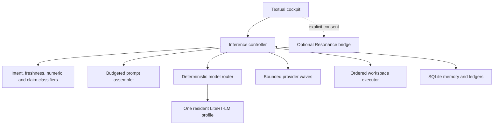
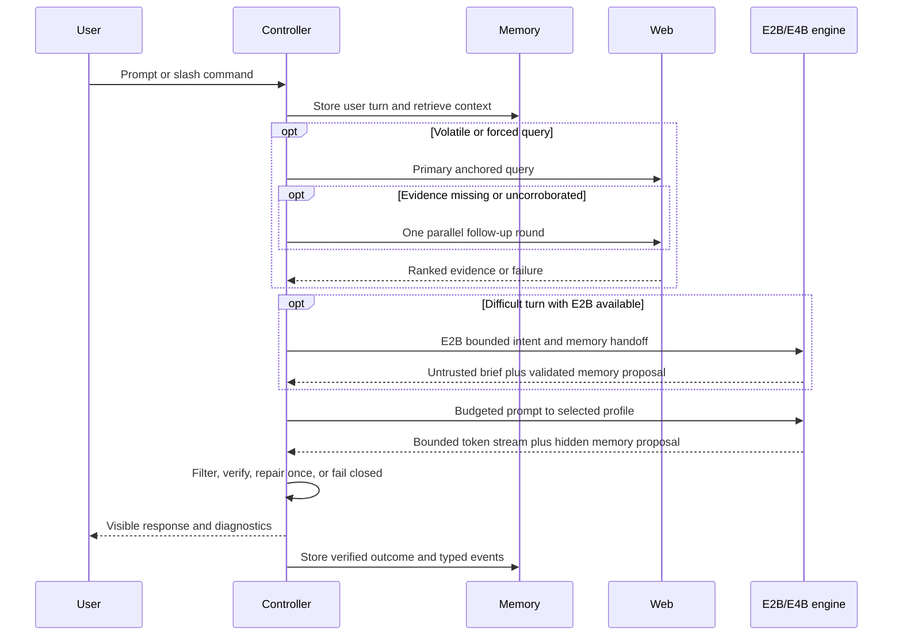

# Architecture

Project Intermix separates generative judgment from deterministic authority. The model may propose an answer, memory update, or workspace action; controller code decides whether it is grounded, safe to display, eligible for storage, and authorized to execute.

## Runtime topology



### Trust boundaries

| Boundary | Model may propose | Controller owns |
|---|---|---|
| Visible answer | Natural-language draft | Hidden-protocol filtering, grounding validation, numeric checks, final display |
| Stream integrity | Incremental token output | Output ceiling, explicit cancellation, exact repetition/control-token detection, incomplete-turn quarantine |
| Memory | Versioned upsert/delete proposal | Schema validation, explicitness, sensitivity rules, provenance, conflict history |
| Model handoff | Bounded E2B intent and memory proposal | Route selection, profile availability, unload-before-load, validation, E4B fallback |
| Persona | Explicit communication preference | Changelog, bounded prompt injection, undo, no inferred diagnosis or immutable trait |
| Web | Search need and synthesis | Query classification, anchored query plan, provider choice, timeouts, cooldowns, relevance, source IDs, caching |
| Workspace | Ordered XML tool tags | Path containment, size ceilings, checkpoints, execution timeout, stop-on-failure, deletion review |
| Mission state | Next-step suggestion | Durable task ledger, epochs, acceptance criteria, verified event log, completion gate |
| Audio | Completed response text | Explicit button consent, fresh heartbeat, immutable request, WAV hash, Android playback |

Web pages and tool output are always data. Neither can override system instructions.

## One conversational turn



## Physical and virtual context

The runtime reserves a fixed physical KV window but assembles each prompt selectively. It does not claim a literally infinite context.

| Mode | Input ceiling | Output reserve | Intended use |
|---|---:|---:|---|
| Lookup | 2,200 | 5,800 | Exact current fact with evidence |
| Brief | 7,200 | 800 | Deliberately short answer |
| Normal | 6,800 | 1,200 | Everyday conversation; normally ten sentences or fewer |
| Deep | 5,800 | 2,200 | Substantial explanation |
| Workspace | 5,200 | 2,800 | Tool actions and repair loops |
| Creation | 4,000 | 4,000 | Scripts, lore, and long-form artifacts |

The total remains 8,000 tokens in the reference profile. `runtime_config.py` makes the physical ceiling configurable; the public installer only chooses 8,000 automatically on the recommended memory tier.

Prompt blocks are independently budgeted and evicted in a deterministic order. Mandatory user text, response contracts, grounding requirements, and integrity constraints survive before optional old dialogue.

## Memory planes

Intermix keeps different kinds of continuity separate:

- **Messages:** complete session transcript rows.
- **Session checkpoint:** summary, current task, open loops, decisions, tone, and active project.
- **Durable memories:** versioned preferences and facts with confidence, salience, provenance, expiry, conflicts, and revisions.
- **Typed events:** explicit project, work, goal, preference, commitment, and opt-in wellbeing statements.
- **Mission ledger:** task goal, acceptance criteria, ordered events, file hashes, tests, failures, epochs, and completion.
- **Web cache and fact watches:** retrieved evidence with timestamps, expiry, and provider metadata.

SQLite FTS5 supplies lexical retrieval without a second embedding model. This keeps the mobile memory layer small, inspectable, and dependency-light.

## Inference lifecycle

`resident_engine.py` creates the LiteRT-LM engine on one dedicated worker thread, not Textual's event loop. Each assembled prompt receives a fresh conversation object while the expensive engine remains reusable. The optional E2B librarian and required E4B reasoning model are profiles of this single manager: switching closes the current engine before constructing the next one.

Every resident conversation receives the selected response policy's physical
output ceiling. The Textual handler launches foreground inference as an async
worker, leaving STOP and `Ctrl+X` responsive. Cancellation is cooperative at a
native stream boundary: the consumer detaches promptly, the conversation closes
on its owning worker thread, and an interrupted engine is discarded rather than
reused. The PTY fallback terminates its subprocess on the same shared signal.

`generation_guard.py` observes only visible streamed text. It stops exact runaway
word/phrase cycles, three consecutive duplicated long blocks, leaked model
control tokens, legacy visible memory-delta markers, and invalid control or
replacement characters. It does not judge topic, style, opinion, or factual
quality. A
stopped partial remains visible in the current cockpit but is recorded only as a
controller-owned incomplete event; it cannot become an assistant message, memory
proposal, agent action, or voice request.

The residency profile uses Android `MemAvailable`:

- **Performance:** keep the engine resident for the configured idle window.
- **Balanced:** shorten the idle window.
- **Pressure:** unload after a short grace period.
- **Critical:** unload rapidly and reject unsafe prewarming.

The CLI/PTY path remains an isolated fallback. Engine initialization, prefill/first-text time, generation time, failures, and available memory are reported separately.

## Grounding pipeline

`freshness_policy.py` classifies stable, evolving, and volatile questions before the model runs. `search_planner.py` converts the original request into one primary search and at most two follow-up wordings. The plan is deterministic and anchored to terms from the user's question; neither E2B nor E4B may silently introduce another product, version, or claim before retrieval. `claim_contracts.py` recognizes exact claims such as the latest stable Python release. `web_search.py` then executes the smallest useful provider wave.

An authoritative exact result ends the search immediately. A non-exact result normally requires two distinct source hosts. If the primary wave cannot reach that threshold, one parallel follow-up round targets official documentation, implementation/design evidence, independent corroboration, or known limitations according to the question's intent. The complete search stays within a hard eight-request ceiling. `/web last plan` exposes the non-secret execution report.

Forced `/web` answers must cite a supplied source identifier. Exact facts can be rendered in controller-owned cards. Non-exact answers may add one concise “Further path” only when retrieved evidence supports the adjacent implementation, rationale, trade-off, or limitation. If the evidence is irrelevant, stale, conflicting, or uncited, the draft is discarded. One bounded repair attempt is permitted; persistent failure becomes a visible grounding guard.

## Numeric integrity

`numeric_integrity.py` extracts user-supplied anchors, clocks, dates, versions, and arithmetic relationships into a controller ledger. A response that mutates an exact anchor is hidden and receives one repair pass. If the repair still violates the ledger, the controller returns a safe fallback instead of showing the bad number.

This is intentionally conservative: it reduces avoidable number drift but is not a proof system or general-purpose calculator.

## Workspace execution

The workspace executor supports read, list, literal search, complete-file write, bounded Python execution, and deletion request tags. Paths are resolved beneath one configured root and checked against symlink escape. Every overwrite receives a content-addressed checkpoint.

Execution is ordered and stops at the first failure. Later generated actions from the same response are discarded. A new mission epoch receives verified failure output and can repair the file. Completion requires both the requested result and required post-write tests.

Generated deletion is a proposal. The user reviews it, and approval revalidates the current hash so a changed file cannot be deleted under stale consent.

## Filesystem layout

```text
~/project-intermix/
├── current -> releases/1.4.1-alpha.1/
├── previous -> releases/<prior>/
├── releases/                 versioned source-only runtimes
├── memory/sovereign.db       private SQLite state
├── models/                   optional cache directory; weights may live elsewhere
└── archive/                  local rollback snapshots and explicit exports

~/.config/intermix/
├── config.json               mode 600; non-secret runtime choices
└── providers.env             mode 600; controller-only provider secrets

~/storage/downloads/intermix_workspace/
└── .intermix/                checkpoints, deletion reviews, and mission metadata
```

The paths are defaults, not public-source assumptions. They can be replaced through the installer, JSON config, or environment overrides.

## Shutdown and recovery

- The TUI shuts down the worker without blocking indefinitely.
- Interrupted or mechanically corrupted generations are visibly marked and
  quarantined from assistant memory and voice.
- Conversation and mission state are committed before they are treated as complete.
- Version activation uses an atomic symlink replacement.
- `intermix-rollback` swaps code releases while leaving memory and provider data untouched.
- The installer takes a private SQLite backup through SQLite's backup API before an upgrade.
- Signal 9 cannot be caught. Persistence and atomic writes limit damage, but Android may still terminate a resource-heavy process.

## Deliberate non-goals

- General unrestricted shell access.
- Automatic deletion without review.
- Captcha bypass, rotating proxies, or rate-limit evasion.
- Inferring diagnoses or sensitive wellbeing state.
- Feeding credentials, web instructions, or raw tool output into a higher trust tier.
- Claiming support for a device based only on similar specifications.
