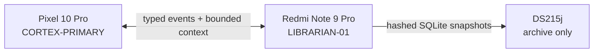

# LIBRARIAN-01 distributed continuity

LIBRARIAN-01 is the ordinary-service implementation of Project Intermix's
distributed continuity design. It keeps the durable authority on a Redmi Note 9
Pro (`miatoll`), lets a Pixel 10 Pro act as the replaceable reasoning cortex, and
uses a Synology DS215j only for verified snapshots, event packs, and releases.

The implementation is software-validated as of 2026-09-19. It is not yet an
on-device compatibility claim. Flashing, bootloader changes, partition writes,
release signing, key rotation, and physical deployment remain explicit human
operations.

## Frozen topology



| Node | Authority | May disappear temporarily | Must never do |
| --- | --- | --- | --- |
| Redmi Note 9 Pro | Immutable events, derived memory, friction, goals, state, jobs, snapshot catalogue | No; this is the continuity authority | Expose an unauthenticated listener, write model prose directly into authority tables, or remove the installed battery |
| Pixel 10 Pro | E4B reasoning, user interaction, event outbox, model proposals | Yes; queued events replay on return | Become the only continuity copy or mutate memory without deterministic validation |
| DS215j | Content-addressed snapshot and release archive | Yes; local operation continues as `NO_NAS` | Host a live SQLite database/WAL, execute continuity logic, or become public-facing |

LAN/Wi-Fi is the primary path. LTE is a WAN fallback, not the database transport
or a reason to expose the service publicly. The Pixel's cellular hardware is not
assumed to be available.

## Authority invariants

1. Raw events are immutable. Replaying the same global ID and canonical payload
   is a duplicate; reusing an ID or node sequence with different bytes is a
   recorded conflict.
2. Every new memory atom requires committed evidence. Model output is a proposal;
   schema, authority, bounds, epistemic type, and provenance are validated inside
   one transaction before commit.
3. Contradictions become visible friction. A competing state value does not
   silently replace the current register unless an explicit resolution is
   supplied.
4. Context packets are bounded controller data with source IDs. Embeddings are
   optional and chain-of-thought is never stored.
5. SQLite and its WAL remain local to LIBRARIAN-01. Only consistent SQLite Backup
   API images and canonical manifests cross to the NAS.
6. A failed worker cannot terminate the authority. Jobs retry with bounded leases;
   terminal failures open runtime friction.

## Repository components

| Path | Responsibility |
| --- | --- |
| `engine/librarian/schema.sql` | Additive Continuity Lattice v0.3 schema and immutable-event triggers |
| `engine/librarian/store.py` | Transactional migration, typed ingest, memory validation, friction, context, jobs, integrity |
| `engine/librarian/snapshots.py` | Consistent snapshots, manifests, verified archive copies, safe restore-to-new-path |
| `engine/librarian/service.py` | Bounded authenticated JSON/HTTP protocol |
| `engine/librarian/client.py` | Cortex client with durable SQLite outbox |
| `engine/librarian/workers.py` | Resource-gated disposable job workers |
| `engine/librarian/network.py` | Narrow network/resource sensor contracts and safe unknown defaults |
| `LibrarianNetworkSentinel.kt` | Unwired Android transport/validation skeleton with injected endpoint probes |
| `engine/librarian_bridge.py` | Optional, failure-isolated Termux controller bridge |
| `engine/librarian_cli.py` | Initialization, service, health, context, snapshot, restore, and worker commands |

The lattice is additive to the configured `sovereign.db`; existing sessions,
messages, memories, revisions, and FTS tables remain intact. The Android app's
database remains separate and app-private.

## Initialize without serving

The public installer creates the additive schema and registers the node roles. It
does not automatically import legacy rows. To project existing Termux messages
and accepted memories later, run the idempotent import deliberately:

```bash
intermix-librarian init --import-existing
intermix-librarian health
```

If the database predates the current lattice, `init` first creates a mode-600,
SQLite-verified backup and canonical hash manifest under the configured archive.
Other Librarian commands refuse an uninitialized/older lattice so an accidental
`health` or `serve` invocation cannot bypass that migration gate. Repeat `init`
on the current schema is idempotent and does not create redundant backups.

To create the service token at the same time:

```bash
intermix-librarian init \
  --token-file "$HOME/.config/intermix/librarian.token" \
  --create-token \
  --import-existing
```

Token creation is exclusive and mode 600. The command refuses to overwrite an
existing token or read one with group/other permissions.

## Install the supervised Redmi service

The runit helper resolves the installed launcher, writes mode-700 run scripts,
rotates bounded logs, and installs the service in the down state unless
`--enable` is explicit. Install Termux's `termux-services` package first so
`sv` and `svlogd` are available:

```bash
tools/install_librarian_service.sh --dry-run
tools/install_librarian_service.sh
tools/install_librarian_service.sh --enable
```

The safe default is `127.0.0.1:8765`. For a remote Pixel, choose one of these
transport boundaries:

- keep Librarian on loopback and terminate authenticated HTTPS in a reviewed
  reverse proxy; or
- bind only the Redmi's encrypted-overlay address and pass
  `--trusted-overlay`. The Cortex client must separately opt into HTTP on that
  overlay, preventing an accidental plain-LAN configuration.

Bearer authentication is required for every request whenever a token is
configured. The supervised service also binds that token to `cortex-primary` by
default; repeat `--client-node-id` only when another registered client genuinely
needs access. A token authenticates; it does not encrypt traffic.

Example encrypted-overlay installation:

```bash
tools/install_librarian_service.sh \
  --host 100.64.0.10 \
  --trusted-overlay \
  --enable
```

Do not use `0.0.0.0` on ordinary Wi-Fi, port-forward the service, or publish it
through the DS215j.

## Connect the Pixel cortex

The existing Termux controller bridge is disabled unless a URL is configured.
When enabled, user events commit before recall, assistant events link to the user
event, and only memories already accepted by the local deterministic memory
validator are proposed to Librarian. Network failures degrade to the established
local path and retain events in the Cortex outbox.

For HTTPS:

```bash
export INTERMIX_LIBRARIAN_URL="https://librarian.example.internal"
export INTERMIX_LIBRARIAN_TOKEN_FILE="$HOME/.config/intermix/librarian.token"
export INTERMIX_LIBRARIAN_NODE_ID="cortex-primary"
intermix
```

For plain HTTP carried inside a separately verified encrypted overlay, add the
explicit second interlock:

```bash
export INTERMIX_LIBRARIAN_URL="http://100.64.0.10:8765"
export INTERMIX_LIBRARIAN_INSECURE_LAN=1
```

The variable name is intentionally cautionary: use it only when the enclosing
transport already supplies encryption and peer authentication.

## Snapshot and DS215j archive flow

Create a verified local snapshot without requiring the NAS:

```bash
intermix-librarian snapshot --reason "before device update"
```

When a reviewed DS215j share is mounted, replicate the same artifact:

```bash
intermix-librarian snapshot \
  --reason "nightly continuity checkpoint" \
  --archive-root "/path/to/mounted/archive"
```

The archive adapter writes a random `.partial`, flushes it, verifies byte count
and SHA-256, then atomically renames it. An unavailable target leaves a retryable
replication row; it does not block local ingest.

Restore always targets a new database path:

```bash
intermix-librarian restore \
  ./00000001-ID.sqlite3 \
  ./00000001-ID.manifest.json \
  ./recovery/sovereign-restored.db \
  --manifest-sha256 DIGEST_PRINTED_AT_CREATION
```

The expected manifest digest comes from the original snapshot response or trusted
local catalogue, not from an untrusted archive directory. The command rejects an
existing destination, non-canonical or unexpected manifest fields,
filename/size/hash drift, SQLite corruption, and foreign-key failure. Review the
restored copy before changing runtime configuration. Code rollback with
`intermix-rollback` does not erase or downgrade the live database.

## Health and resource gates

```bash
intermix-librarian health
```

Health output exposes database integrity, queue depths, last event, last local
snapshot, last verified NAS copy, process resources, and network observations.
Relevant states include `HEALTHY`, `NO_NAS`, `NO_CORTEX`, `NO_WAN`,
`CELLULAR_FAILOVER`, `MEMORY_PRESSURE`, `THERMAL_LIMIT`, `STORAGE_PRESSURE`,
`DB_RECOVERY`, and `RECOVERY_REQUIRED`. Unknown sensor values remain `null`; the
service does not invent reachability.

Jobs can require minimum free RAM, a maximum observed temperature, and charging.
A requirement with an unknown or unsafe sensor value remains pending. The
current default pressure signals are below 384 MiB free RAM, at least 43 °C at
the hottest available sensor, and below ten percent free storage. These are
conservative controller thresholds, not a substitute for initial on-device
thermal characterization with the battery installed.

The portable sentinel uses read-only Linux/Android kernel surfaces. The native
Android skeleton uses `ConnectivityManager` for transport, validated Internet,
VPN, and metered state; the normal `ACCESS_NETWORK_STATE` permission is declared.
NAS and Cortex reachability remain injected cached results from future bounded,
authenticated background probes—the class performs no endpoint I/O itself and is
not wired into the current UI lifecycle. `ACCESS_WIFI_STATE` is needed only if
Wi-Fi link metadata is later added. SSID scanning, location, telephony
identifiers, and broad storage permissions are not required and were not added.

## Protocol surface

| Operation | Method and path |
| --- | --- |
| Capabilities / health | `GET /v1/capabilities`, `GET /v1/health` |
| Immutable event ingest | `POST /v1/events`, `POST /v1/events/batch` |
| Validated memory proposal / lexical query | `POST /v1/memory/delta`, `POST /v1/memory/query` |
| Bounded context | `POST /v1/context/compile` |
| State, goals, friction | `GET /v1/state`, `GET /v1/goals`, `GET /v1/friction` |
| Jobs | `POST /v1/jobs`, `GET /v1/jobs/{id}`, `POST /v1/jobs/{id}/result` |
| Liveness | `POST /v1/node/heartbeat` |
| Snapshot | `POST /v1/snapshot` |

Request bodies are capped at 256 KiB and responses at 512 KiB on the Cortex
client. Unknown fields fail closed. The API never accepts free-form SQL, shell
commands, model weights, credentials, or chain-of-thought. Events use global IDs;
jobs use caller-supplied job IDs; heartbeats and snapshots use request IDs; exact
replays are idempotent and changed bytes under the same identity are rejected.

The Cortex client can submit and flush events, query memory, compile context,
enqueue/read/complete jobs, report heartbeat state, and request snapshots. The
ordinary-service worker set provides lexical FTS maintenance, bounded context
checkpoints, duplicate-candidate preparation, episode-source preparation,
friction-resolution request preparation, integrity checks, and an explicit
`skipped` result when no embedding runtime is configured. Cortex-required
preparation results remain typed jobs; they are not hidden model reasoning.

## Verification

Run the deterministic suite and the repeatable software benchmark:

```bash
PYTHONPATH=engine python -m unittest discover -s tests -v
python tools/benchmark_librarian.py
```

The benchmark creates only synthetic temporary data. It measures immutable
ingest, evidence-backed memory commits, bounded queries, duplicate replay,
snapshot creation, archive verification, and restore. Its four-GiB result is a
process-envelope check in the current test environment, not Redmi device proof.

### Daily on-device flight

After installation, run the daily flight on LIBRARIAN-01:

```bash
intermix-flight
```

The flight checks the live database's schema, integrity, health state, queues,
and resources. By default it creates one replay-safe live snapshot per UTC day.
It then exercises immutable ingest, duplicate replay, an evidence-backed memory
commit, bounded recall, snapshot, filesystem archive, and restore in a disposable
shadow database on the same phone and storage path. Synthetic flight content is
therefore never inserted into real continuity.

Reports are mode 600 beneath
`~/project-intermix/archive/librarian-flight-reports/`. They contain provider
readiness booleans and controller budgets, never key values or live queries.
Each report has a collision-resistant filename and an adjacent SHA-256 sidecar;
the publisher refuses to replace an existing report artifact.

After optional provider keys are configured, explicitly add a fixed,
non-personal live canary for at most two providers:

```bash
intermix-flight --provider-canary
```

Use `--canary-providers 1`, `2`, or `3` to choose the cap. The canary sends only
the built-in `python-docs-v1` public query, discards titles, snippets, URLs, and
page content, and retains provider names, redacted errors, counts, timing, and a
pass/fail state. The flag is not enabled by default because key storage alone
must never authorize outbound traffic or quota use.

To verify the mounted DS215j copy in the same flight:

```bash
intermix-flight --archive-root /path/to/mounted/archive
```

To perform health plus the disposable shadow loop without creating the day's
live snapshot:

```bash
intermix-flight --no-snapshot-live
```

This produces real device/runtime evidence, but one passing run is not a battery,
thermal, network-loss, or long-duration compatibility claim.

Before calling the Redmi compatible, collect on-device cold/warm latency,
resident RAM, sustained-write growth, battery temperature, thermal throttling,
restart recovery, Wi-Fi loss, Cortex loss, NAS loss, LTE fallback, and snapshot
restore evidence. Gemma E2B/E4B resident-model handoff remains a separate
evidence-driven milestone.
