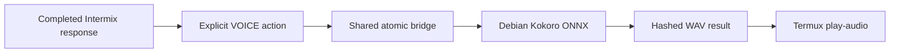

# Optional Resonance / Kokoro voice bridge

Resonance is an optional companion, not a core dependency. The verified setup uses Android's Debian Linux environment for Kokoro synthesis and Termux for Android-native playback.



## Verified scope

- Pixel 10 Pro running Android 17.
- Android Debian Linux development environment.
- Python 3.13.5 virtual environment.
- `kokoro-onnx` 0.6.1 with CPUExecutionProvider.
- `kokoro-v1.0.onnx` and `voices-v1.0.bin` supplied separately.
- Shared storage bridge and Termux `play-audio` playback.

Android introduced an experimental Linux terminal on selected AVF devices before Android 17, and later expanded GUI support. That does not make this exact voice bridge portable to every earlier build or OEM.

## Why playback returns to Termux

The reference Debian VM exposed only PulseAudio's `auto_null` sink, so `paplay` successfully consumed audio without reaching Android speakers. Copying the WAV through shared storage and using Termux `play-audio` produced native media playback.

If Debian exposes a real audio sink on another device, report it; do not assume the reference limitation is universal.

## Debian synthesis environment

Inside the Android Linux terminal:

```bash
sudo apt update
sudo apt install -y python3 python3-pip python3-venv espeak-ng libsndfile1
python3 -m venv ~/kokoro-env
source ~/kokoro-env/bin/activate
pip install --upgrade pip
pip install kokoro-onnx soundfile
mkdir -p ~/kokoro_tts
```

Place the separately licensed model assets at:

```text
~/kokoro_tts/kokoro-v1.0.onnx
~/kokoro_tts/voices-v1.0.bin
```

Validate without starting Intermix:

```bash
python - <<'PY'
import onnxruntime
import soundfile
from kokoro_onnx import Kokoro
print("ONNX providers:", onnxruntime.get_available_providers())
print("Kokoro imports: ready")
PY
```

The public repository does not currently ship the Debian Resonance service installer. The reference implementation remains an optional downstream component until its device boundary, package licenses, and clean-install flow receive independent testing.

## Termux playback

```bash
pkg install -y play-audio
play-audio "$HOME/storage/downloads/intermix_voice_probe.wav"
```

Use a short non-private probe before enabling the bridge.

## Safety contract

- Heartbeat polling reports online/offline state; it never wakes or loads Kokoro.
- Only a fully generated response that passed hidden-protocol and grounding filters is eligible.
- Voice synthesis begins only after an explicit VOICE action.
- Requests and results are written atomically and identified by random request IDs.
- The result WAV is checked before native playback.
- Cancellation prevents a cancelled request from creating a playable output.
- The model cannot claim that audio played; the controller reports actual state transitions.

Expected states:

```text
OFFLINE → ONLINE → READY → TRANSMITTING → RENDERING → STARTING → PLAYING
```

## Retention

The managed archive retains at most 25 unpinned WAV files. Pinned files are preserved. Partial requests and interrupted playback state receive shorter recovery windows.

Generated audio may contain private response text. Do not sync or attach the archive without reviewing it.

## Resource guidance

Kokoro remains cold until synthesis. On a memory-constrained device, close or unload the main LLM engine before long narration if measured headroom is low. Audio generation and LLM inference should not be assumed safe concurrently simply because each works alone.

The core Intermix install remains fully usable when Resonance is absent, disabled, stale, or offline.
